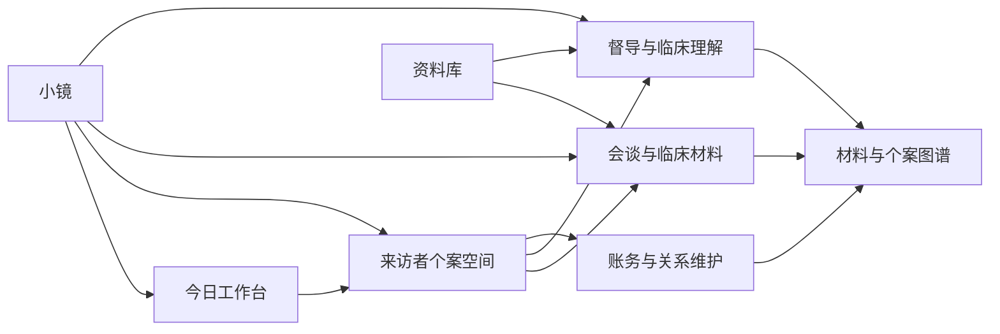
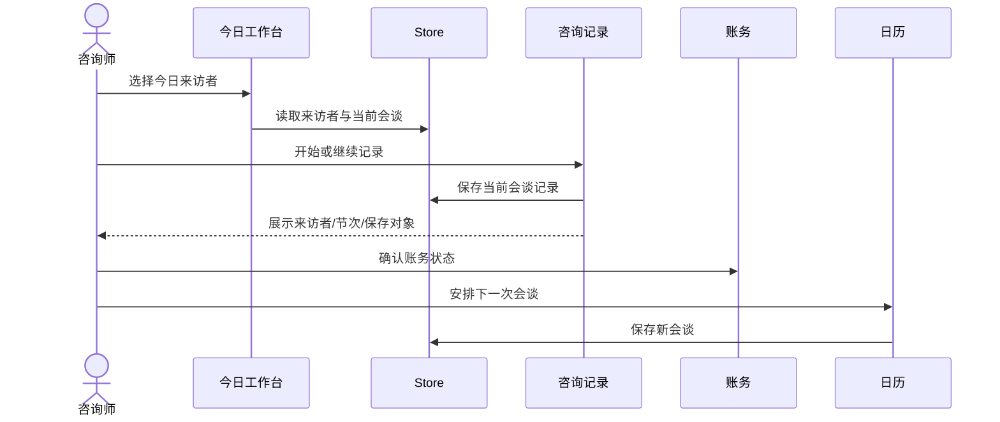

# 心镜 XinJing 最终发展计划（v4.1.1 -> v6.0）

> 文档性质：最终统一规划母版
> 文档状态：Final / 分阶段实施母版
> 代码基线：2026-07-22 快照，`package.json` / `package-lock.json` / `version.generated.js` 均为 4.2.1，HEAD `6910e90`；4.2.1 为本地 `release-ready`、未签名未发布，当前活动列车为 4.2.2 `implementation`
> 当前分支：`release/3.6.3-mac`，该分支名称包含 mac，但当前主开发目标仍是 Windows 桌面端
> 编写日期：2026-07-19
> 规划周期：24-36 个月
> 产品定位：心理咨询师单人执业的本地优先临床工作台
> 视觉基准 A：`design-previews/xinjing-concept-a-clinical-command.html`
> 视觉基准 B：`design-previews/xinjing-concept-b-case-atlas.html`
> 质量铁律：发布关键工作包与最终候选必须通过内部对抗评分与无上下文独立评审，二者均不低于 95 分且 P0/P1 为 0；低风险文档、fixture 和机械核对按第 24.11 节分级治理，但不得据此批准生产或发布

---

## 0. 文档权威与使用方式

### 0.1 本文档的权威级别

本文档是心镜从 v4.1.1 到 v6.0 的唯一最终发展计划，统一吸收并取代以下规划文档的决策职能：

1. `XinJing-中远期发展计划-v3.1-v5.0.md`。
2. `XinJing-路线图-系统版-v4.2起.md`。
3. 本文件此前的 v4.1.1-v6.0 版本。
4. `XinJing-设计HTML落地评估与融合计划.md` 中仍然有效的设计落地经验。
5. `XinJing-v4.1.0-双视角工作台-技术方案.md` 中的材料工作项与双视角数据边界。
6. `XinJing-v4.1.1-统一临床上下文与来源追溯-技术方案.md` 中的来源追溯、上下文快照与防串档规则。

旧文档继续保留为历史证据，但不得再直接驱动版本排期。发现旧文档与本文冲突时，以本文为准；发现本文与当前真实代码冲突时，先更新事实盘点和技术方案，不得默默按文档假设开发。

### 0.2 规划、技术方案和上线计划的关系

本文只决定产品方向、版本边界、UI/UX 目标、数据契约、质量门禁和发布条件。每个实施版本仍须单独形成：

- 技术方案。
- 数据迁移方案。
- UI/UX 页面规格。
- 测试计划。
- 风险与回滚方案。
- 独立评审记录。
- 发布核对表。

任何版本不得因为已写入本路线图而自动获得实施或上线授权。

### 0.3 当前事实不得被历史发布说明替代

2026-07-19 的历史起点是 4.2.0 未放行快照、自测 270/1、Electron 28.3.3 和未签名产物；该事实继续用于解释修复来源，但不再代表当前工作树。

截至 2026-07-22：

- 4.2.1 的 `package.json`、`package-lock.json` 和 `version.generated.js` 已一致，`scripts/self-test.js` 为 283/0；本地候选 SHA-256 为 `3dc2f85e14a3e2118ff7915d97a1d09c67c789eac0363f758f9fcd0d71ff33bc`，状态为 `release-ready`，但未签名、未上传、未发布。
- 当前活动列车是 `4.2.2/implementation/rt-4.2.2-0001`，base commit 为 `6910e90bcc2206658a3c66f6c203216b70089001`。
- Electron 已升级为 43.2.0。正式隔离 wrapper 在临时 userData、默认拒绝网络和保留 sandbox 的前提下通过 22/22 路由、18/18 视觉矩阵和 6 条流程；当前 24 文件 local candidate SHA-256 为 `8a36febe6d9eca9089717cac28924c17dc5612974adcfdaf472ebfe32cfaf0a6`。
- `legacy-write-dom.contract.js` 仍为 `0 CONFIRMED_RUNTIME / 2 CONFIRMED_ORPHAN / 4 BLOCKED`，其侧车 CDP 入口出现 `Target crashed` / `Invalid URL`；无上下文最终评审尚未开始，因此 4.2.2 仍不是 `release-ready`。

- “版本号已经提升”不等于“4.2.0 已完成或已发布”。
- “代码中已经实现”不等于“当前候选包已经验收”。
- “历史上打包成功”不等于“当前工作树可以发布”。
- 自动测试通过不等于 Electron 实机视觉通过。
- Demo 独立评分通过不等于生产路由已经完成融合。

### 0.4 动态事实、文档漂移与维护成本

本文保存方向、边界和带日期的决策快照；可变运行事实以 `package.json`、`package-lock.json`、`version.generated.js`、当前 `release-train.yaml`、候选 manifest 和验收证据为准。不得要求维护者在多个长文档中手工同步同一候选状态。

在 4.3.0 进入生产实现前新增独立 `scripts/validate-plan-facts.js`，而不是继续扩张 `scripts/self-test.js` 或把产品事实塞入 `validate-agent-coordination.js`。校验器只检查可机器证明的事实：三处版本一致性、Electron 版本、固定路由清单、唯一 feature registry、活动 release train、候选状态和本文当前快照字段；HEAD、candidate SHA 和时间戳只作为带日期快照校验，不硬编码成永久产品规则。

协调 schema、validator 和状态机属于“治理内核”，一旦在正反 fixture 下冻结，后续 release train 复用同一 schema 版本，只更新实例数据、锁、任务和证据。只有状态语义或安全边界变化时才升级 schema，并附迁移和反向测试；不得为每个版本复制一套近似 validator。具体分级见第 24.11 节。

---

## 1. 最终决策摘要

### 1.1 产品主线

心镜未来 24-36 个月不再以“增加更多孤立页面”为主，而是围绕一条可追溯的临床闭环收束现有能力：

```text
今日排期
  -> 进入来访者
  -> 完成会谈
  -> 保存记录与材料
  -> 形成临床理解
  -> 进入督导或报告
  -> 完成账务与下次安排
  -> 所有动作可回到来源
```

中期目标是成为咨询师每天真正打开的临床工作台；远期目标是在本地优先、数据可控和来源可见的前提下，逐步建立可信 AI、商业服务、加密同步、移动伴侣和条件式团队版。

### 1.2 两套新 UI Demo 的生产落位

两套 Demo 不互相替代，也不作为两个新的一级产品入口。

| Demo | 最终落位 | 决策 | 原因 |
|---|---|---|---|
| 概念 A：临床指挥台 | `app/index.html` | 融合并逐步替换首页的信息结构，不整文件覆盖 | 与首页“查看并开始今天的工作”职责完全一致 |
| 概念 B：个案图谱桌面 | `app/doc-center.html?clientId=...&view=atlas` | 新增为文档中心的个案图谱子视图 | 属于选定来访者后的纵向材料理解，不应占用一级导航 |

概念 A 负责“今天要做什么”；概念 B 负责“这个理解由什么证据支持”。二者通过稳定的 `clientId`、`sessionId`、`materialId`、`clinicalActionRunId` 和来源引用连接。

### 1.3 不做的事情

- 不删除现有 22 个业务路由来换取视觉统一。
- 不把 Demo 的硬编码数据、内联脚本或临床示例直接复制到生产。
- 不在首页完成完整报告、完整督导或复杂材料编辑。
- 不为个案图谱复制 Session、MaterialWorkspace、Supervision 或 ClinicalActionRun 数据。
- 不把多账号、机构版、完整移动端提前到单人闭环之前。
- 不因为 Tauri 或 Capacitor 已存在脚手架而启动框架重写。
- 不把手动记录、备份、原始数据导出、基础文档导出/打印、数据迁移和基础个案管理设为付费能力。

### 1.4 版本主线

| 阶段 | 建议周期 | 版本 | 核心结果 |
|---|---:|---|---|
| 安全基线、证据与 UI 地基 | 0-3 个月 | 4.2 | 弃发未验收 4.2.0；完成 durable save、Electron/权益/发布契约；概念 A 融合首页 |
| 个案空间与图谱 | 3-7 个月 | 4.3 | 概念 B 融合文档中心；形成来源可追溯的个案工作空间 |
| 可信 AI 内核 | 6-11 个月 | 4.4 | AI 可取消、可比较、可评估、可追溯，统一传输和失败协议 |
| 安全与运营稳定 | 10-16 个月 | 4.5 | 加密备份、更新回滚、模块化与可观测性达到长期维护标准 |
| 商业底座 | 14-20 个月 | 5.0 | 三档产品、算力、支付、激活、请求包和签名运营形成闭环 |
| 加密同步与移动伴侣 | 18-28 个月 | 5.5 | 用户自有同步与轻量移动伴侣，不建设临床明文 SaaS |
| 专业生态 | 24-36 个月 | 6.0 | 在真实需求验证后建立独立团队版、内容包与教学模式 |

---

## 2. 历史规划冲突与最终取舍

### 2.1 已经过时的基线

旧版 `v3.1-v5.0` 计划以 v3.0.3 为基线，其中账单月历、小镜跨页状态、日历、知识库、会员分层、材料工作区和 ClinicalContext 已经部分或完整实现。旧版计划中的对应条目不再作为未来目标，只能作为历史来源。

`PROJECT.md` 仍停留在 1.6.2 和 127 项自测基线，已经不适合作为当前项目总览。v4.2 必须为该文件增加醒目的历史状态说明，或将其内容迁移到版本化日志后停止作为入口文档使用。

### 2.2 多账号与机构版的最终取舍

旧计划曾把多账号放在 v4.2。最终决策是推迟：

- v4.x 和 v5.0 坚持单人执业优先。
- 同一设备多咨询师不是简单增加账号切换，它涉及数据隔离、密钥、备份、授权和审计。
- 团队版必须使用独立的数据边界和权限模型，不允许在单人 Store 上增加一个布尔开关强行改造。
- 只有单人版留存、付费和机构需求都得到证据后，v6.0 才条件立项。

### 2.3 全平台与移动端的最终取舍

旧计划把完整 Android/iOS 版作为 v5.0 目标。最终决策改为：

- 先完成桌面单人闭环。
- v5.5 只做移动伴侣：今日排期、提醒、会谈后一句话备忘、费用草稿和回桌面继续处理。
- 不在移动端首版实现长篇临床书写、完整资料库管理、复杂督导和批量数据维护。
- Electron、Tauri、Capacitor 的长期选择在 v4.4 后按迁移收益和维护成本决策。

### 2.4 首页定位的最终取舍

旧设计曾把首页定义为财务客户经理仪表盘。最终首页定位是临床指挥台：

- 首屏优先今日会谈、待补记录、当前来访者和下一动作。
- 账务保留“本月待收”和异常提醒，但不让收入图表压过临床工作。
- 深度财务趋势仍由 `billing-shell.html` 负责。
- 首页只承载一眼可判断和一击可进入的任务，不承载完整管理功能。

### 2.5 AI fallback、Electron 升级和导出的取舍

- AI 失败可见、手动流程保留和 `primary-ready -> manual-only` 的 fail-closed 两态进入 v4.2；自动切换服务商及六态 fallback 目标模型归入 4.4.0-F，且必须以备用服务真实部署和测量证据为前置，不能照搬旧路线图的服务器描述。
- Electron 28 已超出可接受的长期安全基线；升级前移到 v4.2.1，并作为独立 checkpoint 在 UI 融合前完成。v4.5 负责后续常态化升级，不再承担第一次脱离旧运行时。
- PDF、Markdown、DOCX 导出按业务页面逐步补齐；导出安全和来源摘要选择属于产品契约，不只是格式转换。

---

## 3. 当前真实基线

### 3.1 技术基线

| 项目 | 当前事实 | 规划含义 |
|---|---|---|
| 桌面容器 | Electron 43.2.0，原生 HTML/CSS/JavaScript；正式 sandbox wrapper 已通过当前语义验收 | v4.2-v4.4 不做框架重写；后续按安全 SLA 独立升级 |
| 版本 | package / lock / generated 均为 4.2.1；HEAD `6910e90`；4.2.1 本地 release-ready，4.2.2 正在 implementation | 当前唯一活动列车按 `docs/agent-coordination/v4.2.2/release-train.yaml` 推进，不从版本号推断已发布 |
| 页面 | 22 个固定 HTML 路由 | 保留路由所有权，渐进重构 |
| 数据 | IndexedDB KV + Store 内存缓存 | 新对象优先使用版本化 KV，避免无必要 objectStore 升级 |
| 材料 | `materialWorkspaces` | 继续作为未归档与处理中材料的唯一暂存层 |
| 临床溯源 | `clinicalActionRuns` | 继续作为 AI/处理动作的来源与结果引用记录 |
| AI 上下文 | `ClinicalContext` + SHA-256 快照 | 所有新增临床 AI 必须复用 |
| 权益 | Free / Pro / Flagship 产品语义 | 原始 `full` 归一化为 Pro，`custom` 归一化为 Flagship |
| 视觉 | Clinical / Theatre / Observatory 共享令牌 | 不为皮肤复制页面 |
| 文件解析 | TXT / MD / DOCX，Mammoth | 保持文件类型、大小、路径和外部资源边界 |
| 发布 | electron-builder，Windows NSIS/portable，Mac zip | 发布证据按当前工作树重新生成 |

### 3.2 已实现且必须保留的能力

- 今日工作台、会谈日历、咨询记录、逐字稿、报告、AI 督导、真人督导、大师对话、账务、资料库、设置、激活和关闭确认。
- 双视角工作台和 `xj_workbench_view_v1` 视图偏好。
- 材料上传、解析、关联来访者/会谈、专业页路由和结果回写。
- `ClinicalContext` 统一构造、来源摘要、发送前确认和过期快照拒绝。
- `clinicalActionRuns` 来源追溯。
- 账务与临床会谈隔离口径。
- 批量记账撤销、材料关联重确认和备份集合补齐。
- 资料库关键词、向量和 rerank 分层能力。
- 三套视觉语言与 Lucide 离线图标。

### 3.3 2026-07-19 启动基线问题与当前状态

| 问题 | 真实表现 | 级别/状态 | Owner 角色与关闭目标 |
|---|---|---|---|
| 版本一致性测试失败 | 自测 270/1，失败项仍断言 4.1.1 | P1 | Release Engineering；v4.2.1；版本测试动态读取权威版本且全量自测 0 失败 |
| 客户端可签发付费授权 | `secret.generated.js` 打包 HMAC 对称密钥，客户端可生成 `custom` 激活码 | P1 | Security/Licensing；v4.2.1；客户端只持公钥，伪造 Pro/Flagship 授权测试失败 |
| 权益口径漂移 | 账单月历误配 Free；Free 基础导出/打印被全局文字拦截 | P1 | Product Entitlements；v4.2.1；档位、入口、handler、深链和直接 API 矩阵通过 |
| 持久化不可确认 | Store 写回 fire-and-forget，UI 无法证明保存成功后再切换 | P1 | Data Owner；v4.2.1；durable transaction 和失败保留草稿测试通过 |
| 删除与恢复会静默丢引用 | 删除来访者级联会谈/督导，恢复过滤无效 action run | P1 | Data Owner；v4.2.1；影响预检、tombstone、quarantine 和恢复报告通过 |
| Electron 安全边界过宽 | 多窗口关闭 webSecurity/sandbox，renderer 可取凭据，网络和外链边界过宽 | P1 | Security/Platform；v4.2.1；受支持运行时、所有窗口、IPC、凭据、SSRF 和外链验收通过 |
| 发布源、签名和产物契约冲突 | GitHub/COS 双源，postbuild/签名/元数据顺序未冻结，缺统一 verifier | P1 | Release Engineering；v4.2.1；签名后元数据和 stable evidence 流水线通过 |
| 首页临床工作感不足 | 双视角更像面板入口，未达到概念 A 高频效率 | P2 | Product/UX；4.2.2；2 次主操作闭环与独立评分 >=95 |
| 文档中心缺少纵向理解视图 | 尚无概念 B 的证据、推论和动作链 | P2 | Product/Clinical UX；4.3.0；只读图谱、来源定位和 30 节 fixture 通过 |
| 页面数量高于用户心智任务 | 用户仍需理解内部模块边界 | P2 | Information Architecture；4.2.2-4.3.0；任务测试无需记页面名且路由不减少 |
| 共享 UI 契约不完整 | 密度、标题、控制层级和状态反馈仍不统一 | P2 | UI System；v4.2.2；六 token 组合、组件契约和 18 单元矩阵通过 |
| 核心文件体积和责任过大 | `main.js`、`store.js`、`app.js`、`billing-shell.html` 修改风险高 | P2 | Architecture；v4.5；按单一责任拆分且回归覆盖不下降 |
| 测试仍偏静态 | 源码断言不能替代真实 Electron、拖拽、更新和视觉流程 | P2 | QA/Release；4.2.1-4.4.0 与横向发布门；对应实机与产物门禁落地 |
| 发布证据不完整 | 本地产物存在但未签名，安装、升级、回滚、Electron、视觉和低动效未验收 | Gate FAIL，不单独判缺陷级别 | Release Engineering；横向发布门；所有独立证据齐全后才改变状态 |
| 文档真相源分散 | PROJECT、路线图、发布说明和技术方案存在版本冲突 | P2 | Product/Tech Lead；横向发布门；旧入口标记历史且本文件保持唯一权威 |
| 多端脚手架分叉 | Electron、Capacitor、Tauri 并存但没有统一决策门 | P2 | Architecture；v4.4 决策门；书面选择、退出方案和容量预算完成 |

状态解释：上表前七项 P1 是 2026-07-19 启动 v4.2.1 时的基线，不得继续当作 2026-07-22 的开放问题清单。4.2.1 已以本地候选进入 `release-ready`；4.2.2 已获准进入同一工作树的下一条 implementation 列车。当前开放阻断以 release train 和最新验收报告为准：`legacy-write-dom` 侧车仍有 4 个 BLOCKED，最终独立评审未开始，稳定签名与远程发布均未授权。`Gate FAIL` 允许同一列车修复和内部验收，但始终禁止公开发布；任何被重新证实的产品 P0/P1 必须回到安全基线语义修复，不得以“4.2.1 已完成”为由忽略。

---

## 4. 产品北极星

### 4.1 一句话定位

让心理咨询师在本地完成从一次会谈到记录、材料、理解、督导、报告、账务和下次计划的连续工作，并能清楚知道每一条 AI 建议和每一个后续动作来自哪里。

### 4.2 核心用户

第一阶段只服务单人执业咨询师，重点覆盖：

- 每周 10-40 节稳定个案。
- 需要长期保留会谈、逐字稿、报告、督导和账务。
- 重视隐私，不愿把完整个案库托管给通用 SaaS。
- 愿意使用 AI，但要求 AI 不冒充诊断、不越权写入、不混淆来访者。
- 需要在 Windows 桌面环境重复进行高密度记录与比较工作。

### 4.3 核心工作任务

1. 我今天要见谁，哪些工作尚未完成。
2. 我现在正在处理哪位来访者的哪一节会谈。
3. 这份材料属于谁，能否安全进入记录、报告或督导。
4. 我对个案的理解由哪些原话、观察、督导和历史材料支持。
5. 下一步动作来自哪一条证据，完成后写到了哪里。
6. 我能否在不泄露完整个案库的情况下使用 AI。
7. 我能否随时备份、导出、恢复并迁移自己的数据。

### 4.4 不变原则

1. 手动临床工作流永久免费可用。
2. 临床资料默认留在本机。
3. 远程 AI 只接收用户确认的最小上下文。
4. 活动来访者只是导航便利状态，不是正式归属事实。
5. 正式写入必须校验 client/session/material/supervision 关系。
6. AI 可以建议、整理和比较，不能自动诊断、编造事实或未经确认修改正式记录。
7. 备份、原始数据导出、基础文档导出/打印、恢复、安全和数据迁移不作为高级会员专属能力。
8. 同一事实只保存在一个权威对象中，其他界面只引用。
9. 先完成单人闭环，再做移动端；先验证协作需求，再做机构版。
10. 任何 P0/P1、低于 95 分或缺少适用的运行/视觉证据的生产步骤都不得上线。

---

## 5. 产品指标体系

### 5.1 北极星指标

**有效会谈闭环数**：一节已完成会谈在 48 小时内完成记录、账务状态和下一步安排，且所有正式产物归属一致、来源可追溯。

### 5.2 用户效率指标

| 指标 | 目标 |
|---|---|
| 首次价值时间 | 安装后 30 分钟内完成新建来访者、安排会谈和保存首份记录 |
| 今日任务进入时间 | 启动后 10 秒内进入目标来访者当前会谈 |
| 会谈后记录开始时间 | 从首页到编辑器不超过 2 次主要操作 |
| 重复选择上下文次数 | 同一工作链内不重复选择已确定的来访者与会谈 |
| 来源定位时间 | 从推论或动作打开原始来源不超过 2 次操作 |
| 窄窗可用性 | 1024x700 下不依赖横向滚动完成主流程 |

### 5.3 质量指标

- 数据丢失：0。
- 跨来访者正式写入：0。
- AI 取消或过期后误写入：0。
- 备份恢复对象与引用一致率：100%。
- 来源型 AI 输出可追溯覆盖率：100%。
- P0/P1 未关闭上线次数：0。
- 关键页面无障碍阻断：0。
- 自动更新导致数据损坏：0。

### 5.4 商业指标

- 试用到 Pro 的转化率。
- Pro 用户每周完成的核心 AI 工作流次数。
- 单个付费用户的 AI 成本、支持成本与毛利。
- 请求包购买后的实际使用完成率。
- Flagship 定制能力的交付时间与复用率。

产品分析不得采集临床正文、姓名、原始材料、提示词、文件路径或模型回答。只记录匿名功能事件、耗时、结果状态、版本和失败分类。

---

## 6. 最终信息架构

### 6.1 一级任务域



### 6.2 22 个现有路由的最终所有权

| 路由 | 页面模式 | 最终主任务 | UI 变更策略 |
|---|---|---|---|
| `index.html` | Dashboard | 查看并开始今天的工作 | 融合概念 A，保留现有能力 |
| `chat-home.html` | Assistant Workspace | 查询、定位、路由、轻量操作 | 不作为默认首页 |
| `session-calendar.html` | Calendar Workspace | 排期、开始会谈 | 保持专业日历 |
| `consult-notes.html` | Form Workspace | 完整记录一节会谈 | 保留独立编辑页，与 A 深链 |
| `transcript.html` | Split Editor | 整理逐字稿 | 保留材料来源条和 ClinicalContext |
| `transcript-guide.html` | Guided Conversation | 逐字稿 AI 引导 | Pro 可见预览与门控 |
| `report-writing.html` | Split Editor | 撰写报告 | 保留来源、草稿与导出 |
| `supervision.html` | Conversation Workspace | AI 督导 | 保留独立临床任务身份 |
| `supervision-mindmap.html` | Canvas Workspace | 督导推理图 | 与个案图谱共享画布组件，不共享业务语义 |
| `real-supervision.html` | Timeline/Form | 记录真人督导 | 手动流程免费 |
| `real-supervision-ai.html` | Analysis Workspace | 分析督导记录 | Pro 门控，来源可追溯 |
| `masters.html` | Consultation Workstation | 单人/多人理论会诊 | 不与 AI 督导合并 |
| `doc-center.html` | Document Workspace | 聚合来访者材料 | 新增概念 B 个案图谱子视图 |
| `doc-growth.html` | Trend Workspace | AI 成长轨迹 | 与图谱区分：图谱展示事实链，成长轨迹生成 AI 纵向分析 |
| `knowledge.html` | Document Browser | 管理与检索个人资料库 | 保持分层 RAG |
| `billing-shell.html` | Finance Workspace | 收入、支出、账单和月结 | 不搬到首页 |
| `billing-calendar.html` | Finance Calendar | 每日财务详情 | 目标为 Pro 门控；当前代码误配 Free，须在 v4.2.1 修复并覆盖直接深链 |
| `settings.html` | Settings List | 会员、AI、数据、外观、更新 | 统一设置行，不做卡片堆叠 |
| `feedback.html` | Single Form | 提交反馈 | 保持单任务窗口 |
| `activation.html` | Utility Window | 比较并激活方案 | 显示三档产品和算力区别 |
| `confirm-close.html` | Utility Dialog | 选择关闭行为 | 使用共享令牌与焦点契约 |
| `migrate-helper.html` | Utility Page | 迁移旧数据 | 保持最小权限和恢复说明 |

### 6.3 跨页上下文契约

- URL 中经 Store 验证的 `clientId/sessionId/materialId` 优先于活动来访者。
- MaterialWorkspace 已关联身份优先于便利选择；冲突时拒绝执行。
- 活动来访者只负责预填，不负责覆盖事实。
- 所有保存成功反馈必须包含来访者、会谈和保存对象。
- 所有复杂专业任务由小镜路由到拥有该任务的页面。
- 所有付费能力在父页面保留可理解的预览、最低档位和查看方案入口。

---

## 7. UI/UX 总体方向

### 7.1 设计目标

心镜不再追求“每个页面都像一张漂亮卡片”，而要形成安静、专业、高密度、可重复操作的 Windows 临床工作环境。

界面必须做到：

- 第一眼知道当前来访者、会谈和材料。
- 第一眼知道唯一主操作。
- 每一条材料知道出处。
- 每一个后续动作知道由什么产生。
- 每一次 AI 运行知道使用了哪些来源。
- 页面变化不造成工具栏、计数器、标签和固定区域跳动。
- 1024x700 到 1920x1080 都不出现横向页面滚动、中文裁切和操作失联。

### 7.2 视觉语言

#### Clinical 默认语言

- 冷中性浅灰画布。
- 白色工作面。
- 近黑文字。
- 克制的青绿色主色。
- 蓝色信息、琥珀警告、红色危险、绿色成功。
- 精确、冷静、白天临床工作感。

#### Theatre 会员语言

- 暖舞台灰画布和象牙表面。
- 暖炭文字、酒红主色、低饱和铜色辅助。
- 适合叙事、反思和长篇阅读。
- 不增加窗帘、装饰插图、渐变或舞台拟物。

#### Observatory 会员语言

- 冷灰实验室画布或石墨黑画布，随 Light/Dark 模式切换，不把皮肤本身等同于深色。
- Light 使用冷墨文字，Dark 使用雾白文字，二者共享青蓝主色。
- 金色仅用于 Flagship 身份或高价值状态。
- 适合图谱、督导和夜间观察。
- 不通过机械反色实现。

#### 六种皮肤与显示模式组合

皮肤决定气质和语义色，Light/Dark 决定亮度层级。两者正交，六种组合必须有不同且可审查的 token map：

| 组合 | 画布与表面 | 文字与主色 | 验收重点 |
|---|---|---|---|
| Clinical Light | 冷中性浅灰 + 白色表面 | 近黑 + 青绿 | 白天默认，最高信息密度，不刺眼 |
| Clinical Dark | 深绿灰 + 炭黑表面 | 雾白 + 降饱和青绿 | 长时记录，正文与边框层级仍清楚 |
| Theatre Light | 暖舞台灰 + 象牙表面 | 暖炭 + 酒红 | 叙事阅读，不泛黄、不仿古 |
| Theatre Dark | 深灰紫 + 暗象牙抬升面 | 暖白 + 低饱和酒红 | 保留剧场气质，不变成纯黑红主题 |
| Observatory Light | 冷雾灰 + 浅钢灰表面 | 冷墨 + 青蓝 | 图谱白天检查，网格和来源线清楚 |
| Observatory Dark | 石墨黑 + 抬升深灰 | 雾白 + 青蓝 | 夜间图谱，金色不滥用，选中态不只靠颜色 |

当前 Observatory 的 Light/Dark 共用同一深色 token map，Theatre Dark 也缺少独立目标；这属于 v4.2.2 必须修复的现状，不得把重复截图计为两个合格单元。验收要求：

- 六种组合的背景、表面、文字、边框、焦点、成功、警告和危险 token 均有快照。
- Light/Dark 切换不改变皮肤身份、当前路由、选中对象和草稿。
- 正文、控制、禁用、焦点和状态色满足 WCAG AA；临床状态不得只靠色相区分。
- 任意两种组合不得通过同一组 token 冒充完成。

### 7.3 全局设计令牌

| 类型 | 规则 |
|---|---|
| 字体 | Segoe UI / Microsoft YaHei；长篇临床正文可使用阅读衬线，控制区禁止衬线 |
| 页面标题 | 24px / 1.25 |
| 区域标题 | 18px / 1.35 |
| 控制标签 | 14px / 1.4 |
| 正文 | 15-16px / 1.65 |
| 次级文字 | 13px / 1.55 |
| 最小说明文字 | 12px，不允许 8-11px 承载临床信息 |
| 间距 | 4、8、12、16、24、32、48 |
| 控件高度 | 紧凑 36px、默认 40px、主操作 44px |
| 圆角 | 小元素 4px、控件 6px、卡片和对话框 8px |
| 阴影 | 仅抽屉、对话框和抬升工具使用 |
| 动效 | hover/focus 160ms，抽屉 200-240ms，只使用 opacity/transform |

---

## 8. 概念 A：临床指挥台生产规格

### 8.1 页面归属

- 路由：`app/index.html`。
- 页面模式：Dashboard + Daily Clinical Workspace。
- 主任务：查看并开始今天的工作。
- 唯一主操作：`开始/继续当前会谈记录`。
- 数据档位：手动工作 Free；AI 草稿使用 `ai-notes` 或 `ai-analyze`。

### 8.2 Demo 视觉基准

概念 A 的目标呈现为浅色高密度临床工作台：

- 左侧稳定工具轨约 76px。
- 来访者工作队列约 254px。
- 中央主工作区使用 `minmax(460px, 1fr)`。
- 右侧临床上下文约 292px。
- 顶栏约 64px。
- 来访者与会谈身份条约 92px。
- 主色参考 `#087a5b`，画布参考 `#eef1ef`，表面为白色。
- 卡片圆角不超过 7-8px，不使用装饰性大阴影。

这些数值是视觉和密度基准，不要求在生产中复制 Demo 自建壳层。现有 App 全局导航、窗口拖拽区和共享页面头必须保留。

### 8.3 首页最终结构

```text
全局侧栏
└─ 今日工作台
   ├─ 顶栏：日期 / 搜索 / 通知 / 开始记录
   ├─ 今日摘要：今日会谈 / 待补记录 / 本月待收
   └─ 临床工作区
      ├─ 左栏：来访者队列
      ├─ 中栏：当前会谈与快速记录
      └─ 右栏：来源、风险、理解与下一动作
```

### 8.4 必须保留的现有首页能力

- 今日和本周会谈。
- 三项核心统计。
- 新建来访者。
- 快捷工具自定义。
- 小镜入口与每日概览。
- 资料库、督导、大师、账务、设置和检查更新入口。
- 双视角中已经实现的文档材料入口；其最终位置转为次级“材料收件箱”，不得删除。
- Onboarding 引导锚点。

### 8.5 来访者队列

每行包含：

- 头像或匿名首字。
- 来访者显示名。
- 下一节/最近一节时间。
- 一条可读状态：待记录、待复核、待收款、进行中、暂无任务。
- 状态图标和文字，禁止只靠颜色点。

支持：

- 搜索姓名、别名和当前任务。
- 今天、待处理、全部三个过滤范围。
- 键盘上下移动、Enter 选择。
- 选择后同步更新中央和右侧上下文。
- 列表刷新不改变当前选择，除非对象已被删除。

### 8.6 中央临床工作区

必须包含：

- 来访者身份、当前会谈、时间和时长。
- 最近三节会谈切换。
- 过程记录编辑器。
- 自动保存状态与最后本地保存时间。
- 当前会谈材料来源。
- 后续动作。
- 最近变化。

快速记录只允许编辑当前会谈的轻量过程记录。进入 SOAP、DAP、结构化记录、完整逐字稿或报告时，跳转到专业页面并携带稳定 ID。

保存行为必须：

1. 回写当前 Session 或受控草稿对象。
2. 明确显示来访者、节次、日期和保存对象。
3. 不自动创建账务记录。
4. 给出账务、下次安排、督导和完整记录四个后续动作。
5. 切换来访者或会谈前保存当前内存草稿，失败时阻止切换并保留输入。

### 8.7 右侧临床上下文

显示：

- 当前材料来源和稳定 ID。
- 本节信号。
- 风险与边界。
- 最近纵向线索。
- 由来源产生的下一步。
- AI 草稿入口、产品档位和剩余算力状态。

右栏不是诊断结论栏。所有“理解”必须标明是咨询师记录、督导产物或 AI 草稿；AI 草稿在确认前不得成为正式记录。

### 8.8 窄窗行为

| 宽度 | 行为 |
|---|---|
| 1280px 及以上，生产侧栏展开 224px | 来访者、中栏、右侧上下文三栏同时显示；内容区至少 1056px |
| 1180-1279px，侧栏默认折叠到 68px | 可保留三栏；用户展开侧栏时右侧上下文自动转抽屉，不压缩编辑器 |
| 1024-1179px，侧栏折叠 | 来访者栏收窄，右侧上下文固定为可访问抽屉；中央编辑区保持主导 |
| 1024x700 产品最小视口 | 禁止来访者/编辑器/上下文三栏同时显示；右侧上下文必须转抽屉，入口始终可见；抽屉支持 Escape、焦点移入和焦点返回；不允许横向滚动 |
| 960-1023px 开发兼容 | 只保证可恢复和基础导航，不作为桌面正式发布主验收范围 |

### 8.9 不能从 Demo 直接复制的内容

- 硬编码来访者与会谈。
- 模拟 AI 次数。
- Toast-only 的档案、督导和新增动作。
- 内联 CSS 和内联 JavaScript。
- 自建全局导航。
- 直接以数组保存临床正文。

---

## 9. 概念 B：个案图谱生产规格

### 9.1 页面归属

- 路由：`app/doc-center.html?clientId=<id>&view=atlas`。
- 页面模式：Document Workspace + Canvas Workspace。
- 主任务：查看一个临床理解由哪些材料支持，并从推论回到原始来源。
- 唯一主操作：`打开当前来源`；编辑和 AI 操作是次级命令。
- 基础材料图谱和来源查看 Free。
- AI 纵向摘要使用 `ai-growth` 或 `ai-analyze`。
- Observatory 全局皮肤使用 `premium-skins`；图谱自身的石墨框架与纸张画布属于任务组件，不等于产品皮肤授权。

### 9.2 Demo 视觉基准

- 石墨框架、白色纸张材料画布。
- 时间线约 218px。
- 中央材料画布使用 12 列网格。
- 来源与推论栏约 310px。
- 顶栏约 58px，个案身份条约 86px。
- 强调色使用青绿、珊瑚、青蓝和金色，但每种颜色有固定语义。
- 卡片通过边框、位置和来源标签区分，不使用浮夸阴影。
- 画布网格是工作坐标，不是装饰背景。

### 9.3 与生产全局导航的融合

Demo B 左侧 212px 产品导航不在 `doc-center.html` 内重复实现。生产结构为：

```text
App 全局侧栏
└─ 文档中心
   ├─ 视图切换：材料 / 时间线 / 个案图谱
   └─ 个案图谱
      ├─ 会谈时间线
      ├─ 材料画布
      └─ 出处链与动作
```

### 9.4 视图切换

文档中心增加稳定分段控制：

- `材料`：现有列表和预览能力。
- `时间线`：现有会谈聚合。
- `个案图谱`：新增概念 B。

视图偏好可以保存在 URL 和本地 UI 偏好中；`clientId` 必须出现在 URL 或经 Store 验证的活动选择中。没有来访者时，图谱显示明确空状态和“选择来访者”主操作。

### 9.5 时间线

时间线以 Session 为聚合单元，显示：

- 节次、日期和主题摘要。
- 新材料数量。
- 记录、报告、督导、风险复核和待办状态。
- 当前选择。

切换会谈必须同时刷新：

- 材料画布。
- 出处链。
- 推论。
- 动作。
- 统计和来源 ID。

禁止只修改标题而保留旧材料。

### 9.6 材料画布

首版支持六类节点：

1. 原话片段。
2. 过程观察。
3. 咨询记录。
4. 督导线索。
5. 咨询计划。
6. 风险记录。

每个节点必须包含：

- 来源种类。
- 来源对象 ID。
- 来访者和会谈归属。
- 用户可读定位，例如段落、时间戳或字段。
- 截断状态。
- 打开来源命令。

节点不保存原始正文副本。展示文本来自权威对象的只读 ViewModel；长文本只保存定位和摘要缓存，缓存必须可失效。

### 9.7 来源链

来源链固定为：

```text
原始来源
  -> 观察或结构化记录
  -> 临床理解或督导推论
  -> 后续动作
  -> 业务产物
```

每一条边必须说明关系类型：引用、支持、反驳、延续、产生动作或生成产物。

来源链不能把相关性冒充因果。v4.3 首版图谱完全只读，AI 生成的边只存在于当前预览会话，不持久化，也不存在“确认后进入正式图谱”。用户若确认一条理解，必须先保存到现有 Session、Supervision 或报告权威对象，图谱再从该已保存来源重新派生。只有未来单独定义、迁移并验收 `clinicalInferences` 或 `clinicalGraphRelations` 后，才允许持久化图谱推论和关系。

### 9.8 动作

动作包含：

- 标题。
- 状态。
- 到期范围：今天、明天、下节、具体日期。
- 来源引用。
- 目标页面。
- 完成记录。

动作状态按来访者和会谈隔离。切换会谈不得复用上一会谈的完成状态。

### 9.9 图谱筛选

支持：

- 全部。
- 原话。
- 记录。
- 督导。
- 计划。
- 风险。
- 已确认 / AI 草稿。

筛选只改变显示，不改变选择和来源关系。当前选择被过滤时，显示“当前材料已被筛选隐藏”，不得静默切换到另一条材料。

### 9.10 窄窗行为

| 宽度 | 行为 |
|---|---|
| 1280px 及以上，生产侧栏展开 224px | 时间线、至少 450px 画布和出处链三栏显示；总宽度按 1202px 以上预算 |
| 1180-1279px，侧栏默认折叠到 68px | 可显示三栏；展开侧栏时出处链转抽屉 |
| 1024-1179px，侧栏折叠 | 出处链固定为右侧抽屉，时间线收窄或切换为筛选器，画布保持主导 |
| 1024x700 | 选择材料后可打开出处抽屉；支持 Escape、焦点移入和焦点返回；不允许隐藏来源入口 |
| 960-1023px 开发兼容 | 时间线变为筛选器，工具栏只保留核心命令 |

### 9.11 与其他页面的边界

- `doc-growth.html` 负责 AI 成长轨迹，不复制图谱。
- `supervision-mindmap.html` 负责督导推理过程，不复制个案纵向材料图谱。
- `consult-notes.html` 负责编辑记录，图谱只读展示并深链。
- `transcript.html` 负责编辑逐字稿，图谱只展示受控片段。
- `report-writing.html` 负责报告草稿和导出，图谱只展示产物引用。

---

## 10. 全局交互与状态契约

### 10.1 页面头

每个页面头只包含：

- 页面标题。
- 当前上下文或状态。
- 一个主操作。
- 可选溢出菜单。

不在标题旁并列三个同权重命令。

### 10.2 按钮

每个按钮必须拥有以下一种结果：

- 真实 handler。
- 真实链接。
- 带原因的禁用状态。
- 已实现对话框。

生产代码禁止保留 Toast-only 占位按钮。

### 10.3 对话框与抽屉

- 打开后焦点进入安全初始位置。
- Escape 关闭非破坏性对话框。
- 关闭后焦点返回触发元素。
- 破坏性动作明确说明后果并二次确认。
- 抽屉不得遮住唯一关闭入口。

### 10.4 空状态

空状态必须说明：

1. 当前缺少什么。
2. 为什么会缺少。
3. 一个可执行的下一动作。

例如个案图谱无材料时，主操作是“打开材料中心”或“选择一节会谈”，不是展示功能宣传。

### 10.5 加载状态

- 保持区域稳定尺寸。
- 长任务显示阶段和取消。
- 文件解析显示文件名、进度和失败恢复。
- AI 请求显示来源摘要、模型、取消和失败重试。

### 10.6 错误状态

- 解释发生了什么。
- 保留用户输入。
- 给出恢复路径。
- 跨来访者冲突必须阻断，不允许自动选择一个最近有效对象。

### 10.7 成功状态

成功反馈必须说明修改了哪个对象，例如：

```text
已保存：林女士 · 第 12 节 · 过程记录
```

禁止只显示“保存成功”。

### 10.8 可访问性

- Tab 顺序遵循视觉阅读顺序。
- 所有图标按钮有 `aria-label` 和 tooltip。
- 选中状态使用 `aria-current`、`aria-selected` 或 `aria-pressed`。
- 状态不只靠颜色表达。
- 正文和说明满足 WCAG AA 对比度。
- `prefers-reduced-motion: reduce` 关闭非必要动效。
- 临床信息最小字号 12px。

---

## 11. 核心用户工作流

### 11.1 今日工作闭环



### 11.2 材料处理闭环

```text
选择 TXT/MD/DOCX
  -> 主进程验证与解析
  -> 创建 MaterialWorkspace
  -> 用户确认 client/session
  -> 进入逐字稿/报告/督导
  -> ClinicalContext 显示来源
  -> 保存产物和 ClinicalActionRun
  -> 图谱可回到来源
```

### 11.3 个案理解闭环

```text
选择来访者
  -> 选择会谈
  -> 查看材料节点
  -> 打开出处链
  -> 比较原话/观察/督导
  -> 确认或拒绝推论
  -> 创建有来源的后续动作
```

### 11.4 AI 工作闭环

```text
确定任务
  -> ClinicalContext.resolve
  -> 展示来源摘要
  -> 权益检查
  -> 算力检查
  -> 用户确认发送
  -> 创建 actionRun
  -> 可取消请求
  -> 回调验证 snapshot
  -> 预览结果
  -> 用户确认写入
```

### 11.5 督导闭环

- 选择来访者和会谈。
- 选择当前材料或手工输入。
- 选择取向。
- 显示当前来源。
- 运行 AI 督导或记录真人督导。
- 保存结论、技术、建议和后续动作。
- 图谱显示督导来源和由此产生的动作。

### 11.6 账务闭环

- 已完成会谈只产生账务草稿提示，不自动记账。
- 咨询师确认费用、已收状态和结算方式。
- 免费会谈作为合法账单语义保留。
- 临床记录和财务交易保持独立口径。
- 月结按单个来访者、单个月份生成。
- 批量导入先预览、匹配、去重、确认，提供 batchId 撤销。

---

## 12. 数据架构

### 12.1 权威对象

| 事实 | 权威对象 |
|---|---|
| 来访者 | `clients` |
| 会谈与手工记录 | `sessions` |
| 督导 | `supervisions` |
| 未归档/处理中材料 | `materialWorkspaces` |
| AI/处理动作溯源 | `clinicalActionRuns` |
| 大师对话 | `masterConversations` |
| 支出 | `expenses` |
| 个人理论资料 | UserDocs / 知识库索引 |

### 12.2 个案图谱 ViewModel

v4.3 首版图谱使用只读派生 ViewModel，不新建第二套临床数据：

```js
{
  clientId: 'client_xxx',
  sessionId: 'session_xxx',
  sessions: [],
  nodes: [
    {
      id: 'node_xxx',
      kind: 'quote',
      sourceRef: {
        kind: 'material',
        id: 'mat_xxx',
        anchor: { type: 'timecode', value: '00:16:18' }
      },
      label: '逐字稿原话',
      excerpt: '受控片段',
      status: 'confirmed'
    }
  ],
  edges: [
    {
      id: 'edge_xxx',
      from: 'node_xxx',
      to: 'node_yyy',
      relation: 'supports',
      status: 'confirmed',
      actionRunId: ''
    }
  ],
  actions: []
}
```

ViewModel 不持久化全文。图谱刷新时从 Store 重新构造；如果需要缓存，只保存对象版本、节点 ID、布局坐标和摘要哈希。

### 12.3 来源引用

统一 `SourceRef` 语义：

```js
{
  kind: 'session | material | supervision | report | userdocs | action-run',
  id: 'stable_id',
  clientId: 'client_xxx',
  sessionId: 'session_xxx',
  anchor: {
    type: 'field | paragraph | timecode | range',
    value: 'processNote:2'
  },
  label: '第 12 节过程记录第 2 段',
  normalizationVersion: 'source-normalization-v1',
  sourceVersion: 'store_revision_or_object_updatedAt',
  sourceContentHash: 'sha256:normalized_source_content',
  anchorContentHash: 'sha256:normalized_quoted_segment',
  capturedAt: '2026-07-19T12:00:00+08:00'
}
```

要求：

- `id` 稳定，不使用显示文本拼接。
- `clientId/sessionId` 与权威对象关系一致。
- 所有可变来源在创建引用时同时记录对象版本、规范化全文/字段哈希和锚点内容哈希；哈希只证明内容一致性，不替代稳定 ID。
- 规范化规则必须版本化：UTF-8、LF、Unicode NFC、保留有语义的段落边界；时间码和 range 使用原始稳定单位，不按显示文本计算。
- 打开引用时从权威 Store 重新计算版本和哈希。全文哈希或对象版本变化时必须显示“来源已变化”；即使旧锚点文本仍能找到，也只能作为带警告的候选定位，不能声称来源未变。
- `anchor` 不存在、锚点哈希不匹配或出现多个候选时分别标记 `missing / changed / ambiguous`，不能静默定位到其他内容。
- 旧引用缺少版本或哈希时标记 `legacy-unverified`，允许打开原对象但不得显示“已验证一致”；后台迁移不能伪造历史捕获哈希。
- 不记录绝对路径。

### 12.4 临床任务对象

v4.3 评估新增 KV 数组 `clinicalTasks`：

```js
{
  id: 'task_xxx',
  clientId: 'client_xxx',
  sessionId: 'session_xxx',
  title: '下节追踪拒绝后的内疚感',
  status: 'open | done | cancelled',
  due: { type: 'date | next-session | none', value: '2026-07-20' },
  sourceRefs: [],
  target: { route: 'consult-notes.html', params: {} },
  createdBy: 'manual | ai-draft',
  actionRunId: '',
  createdAt: '',
  completedAt: ''
}
```

首版必须先用内存 ViewModel 验证需求，确认动作跨会谈持久化价值后才迁移。AI 只能创建 `ai-draft`，用户确认后才成为 `open`。

### 12.5 Schema 版本与迁移

- 每个新增持久化对象有 schema 版本。
- 迁移先只读验证，再写入替换。
- 旧备份缺字段时提供默认值。
- 迁移失败不得覆盖原库。
- 迁移前自动备份。
- 备份恢复后校验对象数量、金额、引用和哈希。

### 12.6 删除、合并与孤儿处理

- 当前 `deleteClient()` 会级联删除会谈并按剩余 Session 过滤督导，`importAll()` 会直接过滤无效 ClinicalActionRun；这与目标规则冲突，属于图谱上线前 P1 阻断项。
- 删除来访者和会谈前必须生成只读影响清单，列出记录、材料、督导、账务、任务、ActionRun 和图谱引用。
- 首版采用可撤销删除批次或 tombstone；不得在一个同步函数中静默物理级联。
- 恢复时无效引用进入 quarantine，显示数量、原因和修复选择；不得用 `.filter(isValid...)` 静默丢弃。
- 材料失去来访者后回到未归档状态。
- 图谱节点来源被删除后标记 orphaned，不自动指向同名对象。
- 合并来访者属于高风险迁移，必须生成预览、引用变更清单和可回滚批次。

---

## 13. 可信 AI 架构

### 13.1 统一内核目标

小镜、AI 督导、大师对话、报告、逐字稿、资料库问答继续保留不同产品身份，但共享：

- 请求传输。
- 取消。
- 重试。
- 超时。
- 错误分类。
- 额度协议。
- 来源摘要。
- 临床快照。
- 工具注册和写入确认。

### 13.2 任务白名单

任何临床 AI 任务必须注册：

- 稳定 task ID。
- 产品权益 key。
- 必需来源。
- 可选来源。
- 禁止来源。
- 最大字符预算。
- 输出 schema。
- 写入目标。
- 取消与过期行为。
- 评估集。

未知任务默认拒绝。

### 13.3 权益与算力分离

执行顺序固定：

1. `App.canUse(feature)` 或兼容门控检查产品权益。
2. 检查官方额度、请求包或 BYOK 算力。
3. 构造来源并让用户确认。
4. 才能发送请求。

BYOK 和请求包不提升产品档位。产品有权但无算力时，保留手动流程和恢复路径。

### 13.4 可取消与可恢复

- 流式对话显示停止生成。
- 取消后 actionRun 标为 cancelled。
- 取消后不写正式数据。
- 网络失败保留用户输入和来源选择。
- 支持基于同一来源重新尝试，但产生新的 actionRun。
- 不用重放旧响应伪装成重试结果。

### 13.5 提示词与知识治理

- 每个系统提示词有 ID、版本、任务、模型、作者来源和变更记录。
- 大师知识有 manifest、哈希和冲突合并流程。
- 用户资料库命中片段可展开查看。
- 不伪造页码、出处和引用。
- 临床材料、用户资料库、大师内置知识和既往督导使用不同标签。
- 写作风格属于可关闭表现层，不覆盖事实和来源边界。

### 13.6 AI 评估集

至少覆盖：

- 来访者串档。
- URL 与材料归属冲突。
- 过期结果拒绝。
- 无依据事实。
- 虚构诊断。
- 风险越权结论。
- 逐字稿结构化准确性。
- 报告来源一致性。
- 不同督导取向区分度。
- 大上下文截断。
- RAG 命中和无命中行为。
- 模型失败、限流、取消和重试。
- Prompt injection 与恶意文档。
- 受控督导技能包的篡改、错用户/错设备、过期、撤销、回滚、路径穿越、压缩炸弹、未知文件类型和恶意提示词。

模型、提示词、检索或代理变化都必须运行同一套固定测试集。

### 13.7 受控督导技能包

Flagship 的“定制督导师”不是允许用户安装任意代码插件，而是允许特定用户导入由心镜作者签发的 **受控督导技能包**。作者侧可以用文件夹组织内容，但交付物必须封装为单一 `.xjsup` 加密容器；客户端不得直接打开或执行原始文件夹。该能力用于交付独特的督导取向、提问顺序、观察维度、来源要求、输出 schema 和评估用例，同时继续服从 `ClinicalContext`、SourceRef、人工确认、取消和过期拒绝。

#### 包格式与允许内容

- 外层公开 manifest 只包含 `schemaVersion`、`packageId`、`supervisorId`、`displayName`、`packageVersion`、`minimumAppVersion`、`keyId`、`cipherSuite`、密文哈希、有效期、撤销版本和接收者绑定摘要；作者签名位于容器固定长度 trailer，不作为 manifest 字段，避免自引用。不包含专有提示词、临床示例、用户身份明文或解密密钥。
- 内层密文只允许声明式 UTF-8 JSON/Markdown 资源：版本化系统提示片段、督导流程、提问模板、禁止事项、输出 schema、评分 rubric、合成评估样本和本地显示元数据。禁止 JavaScript、HTML、可执行文件、原生模块、动态 import、shell 命令、网络 URL 自动加载、绝对路径和符号链接。
- 解包前校验扩展名、魔数、总大小、文件数、单文件大小、规范化相对路径和压缩比；拒绝路径穿越、重复路径、Unicode 混淆、压缩炸弹、未知文件类型和 schema 外字段。
- 作者签名覆盖外层 manifest、密文哈希、接收者绑定和所有安全策略；客户端只持作者公钥，不能生成或重新签发合法包。签名验证必须发生在任何解密或解析之前。

首版线格式冻结为 `XJSUP/1`：`8-byte magic 0x58 4A 53 55 50 2F 31 00（ASCII "XJSUP/1" + NUL）+ u16 formatVersion + u32 manifestLength + RFC 8785 JCS manifest + u64 ciphertextLength + ciphertext + 16-byte contentTag + 64-byte Ed25519 signature`，所有整数使用 big-endian。解析器必须先执行长度上限和整数溢出检查，再对 manifest 解码后重新 JCS 序列化并逐字节比较；非规范编码、尾随字节、重复 JSON key、未知必需字段或长度不一致全部拒绝。manifest 中所有 nonce、hash、公钥、salt、wrapped key 和其他二进制字段统一使用无 padding 的 RFC 4648 base64url，并对解码后字节长度做精确校验。

- manifest 必须包含 `packageId`、`supervisorId`、`packageVersion`、`minimumAppVersion`、`authorKeyId`、`cipherSuite`、`contentNonce`、`ciphertextHash`、`contentSchemaHash`、`providerPolicy`、`limits` 和唯一 `recipientGrant`。`recipientGrant` 至少包含 `grantId`、`grantSequence`、`subjectIdHash`、`licenseIdHash`、`deviceKeyId`、`devicePublicKeyHash`、`issuedAt`、`expiresAt`、`revocationEpoch`、`entitlementKey`、`ephemeralPublicKey`、`kdfSalt`、`wrapNonce`、`wrappedContentKey` 和 `wrappedKeyTag`。
- 作者签名固定为 Ed25519，签名输入为 `UTF8("XJSUP-SIG-v1\0") || JCS(manifest) || ciphertext || contentTag`；recipient envelope 使用 X25519 + HKDF-SHA-256 派生 256-bit KEK，再以 AES-256-GCM 包装随机内容密钥。HKDF `info`、内容 AEAD AAD 和包密钥 AEAD AAD 都使用带独立 domain separator 的 JCS 安全字段集合，至少绑定 package/version/grant/subject/license/device/entitlement/expiry/revocation/provider policy；内容 nonce 与 wrap nonce 分属不同密钥域且每次签发唯一。
- 内层明文固定为版本化 canonical resource map，而不是任意 ZIP：key 只能是 NFC 规范化、`/` 分隔、无空段的相对 POSIX 路径，value 是带 media type 和长度的 byte string；同一规范化路径不得重复。作者工具可读取文件夹，但必须先完成路径、类型、大小、数量和 schema 校验，再生成确定性 resource map 和 `contentSchemaHash`。

#### 特定用户和设备绑定

- 每个包使用随机内容密钥进行 AEAD 加密。首版只选择当前 Electron/Node 原生 `crypto` 可稳定实现且经过向量测试的组合（优先 AES-256-GCM + X25519/HKDF recipient envelope）；每次封装使用独立内容密钥、ephemeral key、随机 salt 和唯一 96-bit GCM nonce，nonce 重用测试是一票否决。若改用 XChaCha20-Poly1305，必须引入独立评审过的实现并重新做依赖和产物审计。AAD 覆盖 `packageId + packageVersion + subjectIdHash + licenseIdHash + deviceKeyId + entitlementKey + expiresAt`，任何字段变化都导致解密失败。
- 内容密钥只通过接收者公钥封装。设备首次启用定制服务时优先使用 Windows CNG/TPM 生成不可导出设备密钥；不支持时可退化为 DPAPI 保护的私钥文件，但必须记录降低的保障等级，不能在 UI 或销售说明中宣称与硬件密钥等价。recipient request 由设备私钥签名，包含一次性 nonce、设备公钥、应用版本、不可逆 `subjectIdHash`、`licenseIdHash` 和当前签名授权摘要；签发端不接收临床数据。
- 导入时必须同时通过：作者签名、密文完整性、当前有效 Flagship 授权、`custom-supervisors` feature gate、subject/license/device 三重绑定、有效期、撤销列表、最低应用版本和包版本防回滚。4.4.0-G 的硬前置是 v2 Ed25519 权益声明已成为唯一生产验证路径、旧客户端 HMAC 不再能签发或提升 Flagship；该前置未通过时只能运行合成向量测试，不能安装生产包。任一失败都 fail-closed，且不落盘明文。
- 复制 `.xjsup` 到其他账户或设备后无法通过产品验证和解密。换机、退款、授权转移或设备重置必须由签发端重新封装或撤销旧 recipient envelope，不能复制旧设备私钥。签发服务对每个 `grantId` 维护单调递增 `grantSequence`，并发布签名、单调递增的 `revocationEpoch`；客户端在 DPAPI/TPM 保护且不进入普通备份的 high-water mark 中保存见过的最高 packageVersion、grantSequence 和 revocationEpoch，任何降低都拒绝并要求联网恢复。首版离线宽限上限固定为最近一次成功在线校验后 7x24 小时，服务端签名策略可缩短但客户端、本地设置和技能包不能延长；宽限结束只禁用新运行，不影响历史记录和 Free 手动流程。完全控制本机的授权用户仍可能回滚系统状态，因此不得把该 high-water mark 宣称为绝对防回滚。
- 首版每个 recipient grant 只允许一台 active device。换机或设备重置必须创建新的 device key 和新的 wrapped recipient envelope，并在同一个签名转移事件中撤销旧设备授权；不得并行保留两台 active device，也不得复用旧 wrapped key。
- 已联网并获得更新撤销证据时，撤销对新运行立即生效，不得继续使用离线宽限。七天上限只适用于无法联网且本地仍持有先前有效、未过期签名证据的情形；一旦恢复联网必须先刷新撤销状态再运行。
- 作者 Ed25519 私钥只存在仓库、客户端和应用构建流程之外的离线签发工具中。仓库、CI、安装包和运行时只能持有公钥/稳定 `authorKeyId` 与签名撤销证据；密钥轮换机制使用新 `authorKeyId` 和独立撤销链，但具体轮换周期属运营策略，不影响首版客户端契约。
- 该机制不承诺对已获授权且完全控制本机的用户实现绝对 DRM：截图、进程内存取证或人工转述无法被纯客户端彻底阻止。安全目标是防止文件复制后被其他普通用户/设备直接导入使用，并将越权使用变成可验证失败。

#### 导入接口与运行边界

- 新增主进程独占的类型化 IPC，例如 `supervisionSkill.inspectPackage`、`supervisionSkill.installPackage`、`supervisionSkill.listInstalled`、`supervisionSkill.removePackage` 和 `supervisionSkill.getRuntimeDescriptor`；最终名称在 4.4.0-G 契约冻结时确定。Renderer 只能获得脱敏元数据、状态和稳定 `supervisorId`，不能获得设备私钥、内容密钥、完整解密文件或原始磁盘路径。
- `inspectPackage` 只做只读校验并显示作者、督导名称、版本、接收者摘要、到期日、需要档位、内容类别和外发策略；用户明确确认后 `installPackage` 才把原始密文及最小索引存入应用数据目录。无静默安装、拖入即启用或深链绕过。
- 运行时在主进程内按 `supervisorId + packageVersion` 解密和编译最小督导描述，只把当前任务需要的片段交给统一 AI 请求协议；明文不得写入 Store、localStorage、日志、崩溃报告、备份、导出、剪贴板或 renderer。内存缓存有短 TTL，切换包、锁屏、退出、授权变化和撤销时清除。
- 包内容只构成“督导方法层”，优先级低于心镜安全系统提示、临床数据边界、来源要求、写入确认和模型安全策略。包不能扩大工具 allowlist、绕过最小上下文、改变权益、自动写正式记录、请求额外网络、关闭日志脱敏或把相关性表述为因果。
- `providerPolicy` 默认且缺省必须为 `local-only`。远程模式只能填写心镜受信 provider registry 中的稳定 provider ID 和用途，不允许在包内携带 URL、凭据或自定义 endpoint；运行时取“作者签名 allowlist、应用受信 registry、当前可用 provider、用户授权”的交集。导入预览和每个 `packageVersion + providerId` 首次使用前必须显示将外发的方法类别、模型服务方、撤回路径并取得显式同意；拒绝、未授权 provider、任意 BYOK endpoint、registry 变化或包声明为 local-only 时 fail-closed。传输只包含当前任务最小方法片段，不发送整个技能包；新增 provider 或允许自定义 BYOK endpoint 必须重新冻结安全契约和独立评审，不能由包作者自行开启。
- AI 督导页在 Conversation Workspace 内提供“督导方式”选择器、已安装包状态、Flagship 标签、作者/版本/到期信息、锁定原因和“导入专属包”入口；一个会话固定 `supervisorId + packageVersion`，切换必须新建 actionRun，不得在流式生成中热替换。

#### 生命周期和审计

- 安装记录只保存包 ID/版本、签名 keyId、接收者摘要、密文哈希、状态、安装/最后使用时间和撤销版本；不得保存专有正文或临床输入。
- `ClinicalActionRun` 追加稳定的 `supervisionSkillRef`（仅 packageId、supervisorId、packageVersion、contentHash、authorKeyId、recipientGrantIdHash、grantSequence、bindingAssurance、providerPolicyHash、实际 providerId 和状态），使结果可复现并证明当次授权/设备保障/外发策略，但不复制技能内容、原始设备标识或 subject/license 明文。包缺失、过期或撤销时历史记录仍可阅读，不能再次运行；UI 显示“原督导包不可用”。
- 更新必须使用相同 packageId 的单调版本、重新签名并重新封装；旧版本保持加密归档直到无 ActionRun 引用或用户明确删除。禁止静默降级。
- 包撤销、授权失效或签名 key 撤销不删除用户既有临床记录，只禁用新运行并保留可理解的恢复、换机或联系客服路径。
- 普通临床备份默认只包含原始 `.xjsup` 密文和脱敏索引，不包含设备私钥或可迁移解密能力；恢复到同一 Windows 用户/设备后可重新校验，恢复到新设备必须重新签发 recipient envelope。备份 UI 必须提前说明该差异，不能让用户误以为复制备份即可转移专属授权。

---

## 14. 会员与商业边界

### 14.1 三档产品语义

| 能力 | Free | Pro | Flagship |
|---|---|---|---|
| 来访者、排期、手工记录、账务、备份、原始数据导出 | 完整 | 完整 | 完整 |
| 基础 Markdown/TXT/Word 导出与基础打印 | 完整，可带产品页脚 | 完整 | 完整 |
| 无产品页脚、品牌版式和高级导出模板 | 不含 | `export-clean` | `export-clean` + 定制品牌 |
| 材料上传、关联和基础图谱 | 完整 | 完整 | 完整 |
| AI 记录、报告、督导、成长轨迹和多大师 | 预览/试用 | 完整 | 完整 |
| 资料库 | 关键词 | 向量 | 向量 + rerank + 更大上下文 |
| 视觉皮肤 | Clinical | + Theatre / Observatory | 全部 |
| 模板 | 基础手动模板 | AI 模板 | 定制模板和品牌输出 |
| 督导师 | 固定基础取向 | 全部内置取向 | 受控督导技能包与定制督导师 |
| 支持 | 文档 | 标准支持 | 优先支持与定制服务 |

### 14.2 原始档位归一化

```text
free   -> Free
pro    -> Pro
full   -> Pro（历史兼容，绝不是 Flagship）
custom -> Flagship
trial  -> 不是档位；是叠加在 Free/已购档位上的限时 AI allowlist
```

Trial 权威语义：

- `mode=trial` 或 `aiUnlocked=true` 不能把 `effectiveTier` 提升为 `custom`、Flagship 或任意 rank；当前 `app/js/entitlements.js` 返回 `custom` 的行为是 v4.2.1 P1，必须删除。
- Trial 只允许显式 `TRIAL_FEATURE_ALLOWLIST` 中的 AI 体验 key：`ai-notes`、`ai-analyze`、`ai-report`、`ai-detect`、`ai-supervise`、`real-sup-ai`、`ai-mindmap`、`ai-masters`、`transcript-guide`、`ai-growth`。
- Trial 明确拒绝 `billing-calendar`、`export-clean`、`premium-skins`、`rag-vector`、`rag-rerank`、`custom-supervisors`、`deep-case-mode` 及所有未知 key；Free 的手工核心和关键词检索仍按 Free 正常开放。
- Trial 必须同时满足服务端/本地可信声明中的 `trialId`、`trialActive=true`、`startsAt <= now < expiresAt`、未撤销和 AI 算力可用；过期、缺字段、时钟异常、签名失败或未知状态一律回到基础档位并保留手工数据访问。
- 已购 Pro/Flagship 先按已购档位授权；Trial 只能临时补充 allowlist 中的 AI 体验，不能降低已购权益，也不能升级非 AI 权益。
- 所有 Trial 页面和拒绝提示必须显示“AI 试用”、到期时间和当前正式档位；不得显示为已购旗舰版。

唯一 feature registry 必须为每个 key 同时记录 `minimumTier`、`trialEligible`、展示名称和 handler owner。UI、深链、preload、IPC 和 Domain API 从同一 registry 生成门控与测试预期，不能在页面私建 Trial 判断。

档位归一化不能依赖客户端持有的对称签名密钥。当前 HMAC `LICENSE_SECRET` 被写入打包的 `secret.generated.js`，客户端同时具备签发和验证能力，攻击者可以自行生成 `custom` 激活码；这是 v4.2.1 P1，不得等到 v5.0 商业平台再修。

v4.2.1 起使用版本化非对称授权声明：

```js
{
  schemaVersion: 2,
  licenseId: 'lic_xxx',
  tier: 'pro | custom',
  subjectId: 'opaque_subject',
  machineCodeHash: 'sha256:...',
  issuedAt: '2026-07-19T00:00:00Z',
  expiresAt: '2027-07-19T00:00:00Z',
  keyId: 'ed25519-2026-01',
  signature: 'base64url...'
}
```

- 签发端持 Ed25519 或等价非对称私钥；私钥只存在于隔离的签发服务/开发者签发环境。
- 客户端只打包按 `keyId` 版本化的公钥集合，只能验证，不能签发。
- 生产 `license-core` 不导出 `encodeKey`；签发 CLI 不进入 electron-builder `files`。
- 云激活和离线激活使用同一种签名 payload；离线码只是 payload + signature 的传输编码。
- `full` 旧授权迁移为 Pro，不因历史名称提升为 Flagship。
- 撤销列表本身也由独立 key 签名、带单调版本和有效期；离线宽限明确，不允许回滚到旧撤销列表。

### 14.3 AI 功能 key

继续使用现有稳定 key，包括：

- `ai-notes`
- `ai-analyze`
- `ai-report`
- `ai-detect`
- `ai-supervise`
- `real-sup-ai`
- `ai-mindmap`
- `ai-masters`
- `transcript-guide`
- `ai-growth`
- `billing-calendar`
- `export-clean`
- `premium-skins`
- `rag-vector`
- `rag-rerank`
- `custom-supervisors`

新增 key 必须经过权益矩阵评审，未知 key 默认拒绝。

`custom-supervisors` 只表示当前 Flagship 用户可以检查、安装和运行绑定到自己的受控督导技能包；它不因持有 `.xjsup` 文件、Trial、BYOK、请求包或能够打开导入对话框而自动成立。包授权、产品档位和 AI 算力是三个独立门禁：缺少任何一个都不得运行，且不能把导入成功显示为 AI 可用。

`export-clean` 只表示移除产品页脚、使用高级版式或定制品牌，不得阻断临床内容本身的导出和打印。Free 必须始终可以导出原始数据、基础 Markdown/TXT/Word，并使用基础打印样式。禁止按按钮文字全局拦截“导出/打印”；每个增值命令必须显式绑定 feature key，基础命令使用 `manual-core`。

当前 `app/js/entitlements.js` 把 `billing-calendar` 误配为 `free`，而本设计系统和激活页均规定为 Pro；`preload.js` 又按按钮文字拦截全部导出/打印，超出了 `export-clean` 的语义。v4.2.1 必须同时收口并验证：

- `FEATURE_MIN_TIER` 映射。
- 导航和父页面入口门控。
- 直接打开 `billing-calendar.html` 的页面级门控。
- Free、Trial、Pro、legacy Full、Flagship 和过期状态。
- 原始数据导出、基础文档导出和基础打印在 Free 可完成。
- 高级无页脚/品牌版式只在 `export-clean` 可用。
- 入口、handler、`window.print` 和直接 API 调用都不能绕过或误拦截。

只改入口、不拦截直接深链，仍视为权益绕过和 P1。

### 14.4 商业服务数据边界

服务端只保存：

- 账户标识。
- 授权。
- 设备。
- 额度。
- 订单。
- 必要审计状态。

服务端不保存：

- 来访者正文。
- 逐字稿。
- 报告。
- 督导记录。
- 个人资料库正文。
- 模型完整输入与输出。

---

## 15. 工程架构路线

### 15.1 原则

- 模块化，不一次性重写。
- 先写契约测试，再移动代码。
- 一次只拆一个责任，不同时修改业务语义。
- UI 变化不顺便修改临床数据 schema。
- 数据迁移不顺便重做视觉。

### 15.2 建议模块

#### 首页工作台

- `app/js/workbench-controller.js`
- `app/js/workbench-client-view.js`
- `app/js/workbench-material-inbox.js`
- `app/css/workbench-command.css`

#### 个案图谱

- `app/js/case-atlas.js`
- `app/js/case-atlas-view-model.js`
- `app/js/source-lineage.js`
- `app/css/case-atlas.css`

#### 数据

- Store Repository 分域。
- Schema migration。
- Reference integrity。
- Backup/restore。
- Billing domain。
- Material domain。
- Clinical provenance domain。

#### 主进程

- 窗口与退出。
- 更新。
- 备份与恢复。
- 文件解析。
- 资料库。
- 授权。

### 15.3 大文件拆分顺序

1. `main.js`：先拆窗口/退出与更新，不改变行为。
2. `billing-shell.html`：拆结构、样式、领域逻辑、导入和月结。
3. `store.js`：拆纯函数、完整性和领域 API。
4. `app.js`：拆导航、主题、权益和活动上下文。
5. Agent：统一工具注册、传输协议、会话状态和页面适配。

### 15.4 性能目标

- 启动到工作台可操作时间建立基线。
- 100 位来访者、3000 节会谈、1000 份材料下列表和图谱仍可用。
- 图谱只渲染当前可见节点，长时间线使用分段或虚拟化。
- 文件解析不阻塞渲染线程。
- AI 大文本只按任务切片。
- 不使用 300ms 高频轮询维持 UI 状态。

---

## 16. v4.2：当前候选收口、安全地基与临床指挥台

### 16.1 版本目标

4.2.0 已作为未放行历史快照弃发。4.2.1 本地安全基线已进入 `release-ready`，但未签名、未上传、未发布；当前 4.2.2 正在把首页升级为概念 A 风格的日常临床指挥台，并补齐 Electron 43 与侧车真实入口证据。4.2.2 不得因主语义验收 100/100 而忽略仍为 BLOCKED 的独立侧车契约。

### 16.2 当前 4.2.0 快照：冻结和弃发判定

范围：

- 记录基线日期、HEAD `a0de48f`、分支、完整 dirty diff、package / lock / generated version 和构建环境。
- 保留 `node scripts/self-test.js` 的 270/1 原始证据，确认失败来自过时的 4.1.1 固定断言。
- 固化本地 `dist` 证据：4.2.0 unpacked、NSIS、portable、两个 blockmap 和两份 yml 已存在，生产文件匹配当前工作树，两份 EXE 为 `NotSigned`。
- 检查远程 COS 和 GitHub Release 是否已经存在 4.2.0 同名产物；本地存在不得推定远程已发布。
- 如果任何 4.2.0 产物已经对外可见，后续修复必须 bump 到 4.2.1；禁止覆盖同版本安装器或更新元数据。
- 如果从未对外发布，也只允许把 4.2.0 作为内部快照，不把它写入稳定更新通道。

退出条件：

- 版本、HEAD、工作树、本地产物签名/哈希和远程产物状态有可复核记录。
- 4.2.0 明确标记为 `unreleased / rejected`。
- 没有上传、发布或覆盖任何远程文件。
- 审计证据包本身的内部与无上下文独立评分均 >=95、无事实性 P0/P1；生产代码中的 P1 继续保持公开阻断状态。
- 本步骤只授权进入 16.3 的 P1 修复循环，不授权开始 UI、图谱或任何发布工作。

### 16.3 v4.2.1：数据、安全、权益和发布契约基线

这是所有新 UI 之前的前置版本。

本节采用同一版本号下的内部 checkpoint，而不创建 `4.2.1a/4.2.1b`：数据与 durable、授权与权益、Electron/IPC、安全发布各自绑定 task/contract/candidate SHA，最后由 4.2.1 完整候选统一回归。字母子版本会污染对外版本和更新语义，不能减少真实回归成本；内部 checkpoint 才是正确的隔离层。

#### 持久化完成语义

- 新增等待 IndexedDB transaction 完成的 `persistAsync(key)` 或等价原语。
- 新增 `saveSessionDurable(session)` 或等价 API，成功时返回 `{ ok: true, value, version }`，失败时返回 `{ ok: false, error }`。
- 正式 cache 只在持久化事务完成后提交；失败时保留 UI 内存草稿和原权威对象，不显示“已保存”。
- 来访者/会谈切换必须等待 durable save；失败时阻止切换、恢复焦点并显示来访者、节次和错误类别。
- `importAll()` 必须等待全部集合写入完成，再报告成功；引用无效项进入 quarantine，不得静默过滤。

#### 删除与恢复安全

- 为删除来访者、会谈和材料提供影响预检。
- 引入可撤销删除批次或 tombstone，替换当前同步级联删除。
- ActionRun、任务和图谱引用失去来源时标记 orphaned。
- 恢复报告列出导入、隔离、修复、跳过和失败数量。

#### 非对称授权验证

- 从 electron-builder `files` 移除含 `LICENSE_SECRET` / `APP_PROXY_KEY` 的 `secret.generated.js`；最终 ASAR 和 unpacked 全量扫描不得出现对称授权密钥。
- 将 `license-core.js` 改为只验证第 14.2 节版本化 Ed25519 授权声明，生产包不包含签发函数、私钥或可恢复的对称密钥。
- 开发者签发 CLI/服务与客户端构建隔离，私钥使用独立安全存储；签发日志只记录 licenseId、档位、期限、设备哈希和操作人，不记录临床数据。
- 旧 HMAC 码在 v4.2.1 不再作为新激活依据。已有用户通过订单/激活真相源在线换取 v2 签名声明；离线用户导出无敏感信息的 machine request，由支持侧核验购买后返回签名声明。
- 旧版 `license.json` 只能触发迁移流程，不能自行升级为 v2 授权；无法核验购买时保留 Free 手动数据访问，不删除数据，并提供人工恢复入口。
- 轮换/撤销旧 HMAC 和代理 key，服务端不再仅凭可由旧客户端伪造的 HMAC 码授予付费档位。
- 测试必须证明：从最终 ASAR 无法取得签发密钥；调用旧 `encodeKey` 不存在；自造 Pro/Custom payload、修改 tier/expiry/machine、复用其他设备声明、未知 keyId 和回滚撤销列表全部失败。

#### 权益一致性

- 把 `billing-calendar` 的代码最低档位恢复为 Pro。
- 父页面入口、导航、直接深链和页面运行时使用同一个 feature key。
- 覆盖 Free、Trial、Pro、legacy Full、Flagship、过期和未知 key。
- 手工基础记账仍为 Free；只有每日账单月历详情为 Pro。
- 移除 preload 中基于“导出/打印”文字的全局点击拦截和 `window.print` 一刀切覆盖。
- Free 保留原始数据、基础 Markdown/TXT/Word 导出与基础打印；`export-clean` 只门控无产品页脚、品牌版式和高级模板。
- 分别测试基础导出入口、底层 handler、打印、直接 API 调用和 Pro 增值命令。

#### Electron 安全基线

- 在实施日选择仍处于 Electron 上游安全支持期的稳定版本或前一稳定主版本；不得用“兼容性更稳”继续发布已停止安全维护的 Electron 28。
- 运行时升级单独提交、单独打包和单独回归 IndexedDB、preload、托盘、文件选择、打印、更新、NSIS 与 portable，不与首页 UI diff 混合。
- 如果受支持 Electron 升级无法通过，v4.2 稳定公开发布保持阻断，不以关闭 `webSecurity` 或延后安全补丁换取兼容。
- 安全版本 SLA：每周检查上游公告；Critical 在 72 小时内完成影响判断、7 天内形成候选，High 在 14 天内形成候选；每季度至少完成一次运行时升级演练。
- 盘点主窗口、关闭确认窗口、激活窗口及以后新增的每一个 BrowserWindow；全部显式使用 `contextIsolation:true`、`nodeIntegration:false`、`webSecurity:true` 和目标 `sandbox:true`，不得只修主窗口。
- 把渲染进程的外部 AI 请求迁到主进程受控网络层，通过类型化 IPC 暴露。
- 内置服务商使用版本化可信 origin 注册表。自定义 BYOK 端点必须由用户在设置页明确确认规范化的 scheme、hostname 和 port，形成可撤销的单配置授权，不得自动加入全局白名单。
- 所有端点只允许 HTTPS，URL 禁止内嵌用户名/密码；生产环境拒绝 localhost、环回、私网、链路本地、组播、保留地址和未经批准的 IP literal。
- 首次请求和每次 DNS 解析后都检查目标地址；每个重定向重新验证 scheme、origin 和解析地址，最多 3 跳，任何一跳进入私网或未授权 origin 立即失败，防止 SSRF 与 DNS rebinding。
- 网络层还必须限制连接/总超时、请求和响应体积、可发送 header、日志字段及并发；开发 HTTP/私网 override 只存在于未打包开发构建。
- 将 `sandbox:true` 作为完成目标；preload 只保留 contextBridge 白名单。若迁移遇到明确 Electron 限制，必须有最小例外、到期时间和独立威胁评审，不能用“本地单用户”作为豁免理由。
- 网络迁移完成后从 preload 删除 `appProxyKey()` 和 `decryptSecret()`；渲染进程只能提交配置、请求连接测试和发起受控 AI 任务，不能取得明文 BYOK 或内置代理凭据。
- 立即轮换已经进入历史安装包的代理凭据，服务端拒绝旧 key；不得把代码混淆当作密钥保护。
- `openExternal` 使用可信来源注册表；未登记 HTTPS 主机必须显示规范化 hostname 并要求明确用户手势确认，禁止任意重定向和后台唤起。`http:` 默认拒绝，只有开发环境显式开关可用。
- `mailto:` 不得由后台自动备份直接唤起。自动备份只产生应用内/系统通知；只有用户点击“撰写备份通知邮件”后才可打开邮件客户端。
- `mailto:` 只允许经校验的单一收件地址和固定 `subject/body` 字段，使用标准 URL 编码，拒绝 `cc/bcc/attachment`、CRLF 注入、绝对路径、姓名和临床正文。
- 增加 CSP、`will-navigate`、`setWindowOpenHandler`、permission request、preload 暴露面、凭据外带、外部链接和恶意文档测试。

#### 发布契约统一

- 运行时更新源以 `main.js` 当前使用的 COS 为唯一权威源。
- 在修正 builder 发布配置前禁用 `npm run release`，避免把 GitHub 当作第二更新真相源。
- 明确 `pack` 只产生 unpacked；NSIS 和 portable 必须由 dist 单独生成并分别验收。
- 在 v4.2.1 实现唯一验证入口 `scripts/verify-release-artifacts.js` 和 `package.json` 的 `verify:artifacts`；本地发布及 `scripts/cnb-build.ps1` 不得维护第二套产物判断。
- `verify:artifacts` 校验两个 EXE、两个 blockmap、两份 yml 的存在性、非空、版本、文件引用、size、SHA-512、签名和时间戳，失败统一非 0，并输出带 channel、commit 和最终字节哈希的 `release-evidence.json`。
- 冻结两条互不混用的流水线：internal 允许 unsigned；stable 必须在最终 EXE 完成 Authenticode 签名与时间戳后才运行 postbuild 生成 blockmap/yml，再运行 stable verifier。
- 签名后禁止再修改 EXE 字节；如果任何工具修改最终 EXE，必须重新生成 blockmap/yml、重新验证并废弃旧 evidence。
- COS internal/stable 上传分别只消费同 channel 的成功 evidence；stable 上传不得复用 internal 报告。

退出条件：

- 全量自测 0 失败，且版本测试不再硬编码旧版本。
- durable save、写入失败、切换阻断、删除影响、quarantine 和恢复报告有集成测试。
- 客户端只持公钥，旧 HMAC 不可新激活，伪造 Pro/Flagship、修改声明和跨设备复用测试全部失败。
- 运行时处于上游安全支持期，SLA 和升级回归有证据；所有 BrowserWindow 均为 `webSecurity:true`；外部 AI 经受控 IPC，自定义端点通过 SSRF/重定向/DNS rebinding 测试，renderer 无 `appProxyKey/decryptSecret`，历史代理 key 已轮换，HTTPS 与 `mailto:` 用户手势/编码/数据最小化测试通过。
- 账单月历不存在入口或深链绕过；Free 基础导出/打印不被误拦截，`export-clean` 无绕过。
- COS 发布契约唯一，GitHub builder 配置不再造成误发布；internal/stable 签名顺序、verifier 和 channel evidence 集成测试通过。
- 内部与无上下文独立评分均 >=95，P0/P1=0。

### 16.4 工作包 4.2.2-A：共享 UI 契约

范围：

- 把概念 A/B 使用的密度、表面、来源、状态、抽屉和焦点规则转为共享语义令牌。
- 建立 PageHeader、IconButton、SegmentedControl、StatusChip、SourceRow、ContextDrawer、EmptyState 和 LoadingState 契约。
- 断点计算必须包含展开 224px、窄窗 178px 和折叠 68px 的生产侧栏。
- 清理小于 12px 的临床说明文字。
- 清理无处理器按钮。
- 为浅色、深色、低动效和三皮肤建立独立 QA 维度。
- 实现第 7.2 节六种独立 token 组合，移除 Observatory Light/Dark 共用同一深色映射的现状。

不做：

- 不改变业务数据。
- 不替换所有页面视觉。
- 不引入新框架。

退出条件：

- 组件状态、键盘、焦点、ARIA、错误和加载示例齐全。
- 1024x700 下无横向滚动和来源入口丢失。
- 共享契约内部与独立评分均 >=95，P0/P1=0。

### 16.5 工作包 4.2.2-B：首页概念 A 只读壳层

范围：

- 以现有 `index.html` 为基础重排，不整文件替换。
- 保留现有统计、日程、快捷入口、文档视角、新建来访者和小镜。
- 先接入只读来访者队列、当前会谈和上下文栏，不在同一步引入正式写入。
- 所有页面跳转携带经 Store 校验的稳定 ID。
- 三栏只在满足第 8.8 节生产宽度预算时显示。

核心文件：

- `app/index.html`
- `app/js/dashboard.js`
- 新的 workbench 模块和 CSS
- `app/js/app.js` 仅在共享壳层必要时小改

退出条件：

- 首页原有功能和 22 路由无回退。
- 所有队列、空态、错误态和深链来自真实 Store fixture。
- 18 单元视觉矩阵和低动效套件通过。
- 内部与无上下文独立评分均 >=95，P0/P1=0。

### 16.6 工作包 4.2.2-C：快速记录与动作

范围：

- 快速记录只调用 v4.2.1 验收过的 durable save API。
- 切换上下文前等待持久化完成；失败时阻止切换并保留输入。
- 保存后显示账务、下次安排、督导和完整记录四个下一动作。
- 动作显示来源；首版保持派生，不持久化 `clinicalTasks`。
- 不在本步骤增加图谱推论对象。

退出条件：

- 写入失败、重复点击、断电模拟、切换来访者和过期上下文测试通过。
- 从启动到保存今日会谈记录不超过 2 次主操作。
- 快速记录不串档，失败不丢输入。
- 内部与无上下文独立评分均 >=95，P0/P1=0。

### 16.7 横向发布门：服务、签名与完整发布证据

范围：

- 将 AI fallback 目标状态机归入 4.4.0-F；4.2.2/4.3.0 只实现 `primary-ready -> manual-only`，不自动切换服务商。
- 统一客户端失败状态展示。
- 执行 v4.2.1 已实现的 internal/stable 两条发布门禁，不在本步骤重新定义脚本或顺序。
- 文档入口治理，标记过时 PROJECT 和旧路线图。
- Internal：构建 unsigned -> postbuild -> `verify:artifacts --channel internal` -> 安装/portable/Electron/视觉验收；只进入 COS internal。
- Stable：从同一冻结 commit 以 builder 集成签名或外部签名生成最终 EXE -> Authenticode + 时间戳 -> postbuild -> `verify:artifacts --channel stable` -> 对最终签名字节重跑安装、升级、回滚和 Electron 冒烟。
- Stable 的 blockmap、yml、SHA-256/SHA-512 和 `release-evidence.json` 必须全部在签名后生成；任何签名后字节变化使证据失效。
- 只有 stable evidence 成功并完成小范围验证，才允许提升到 COS stable；GitHub 不参与运行时更新。

本节拆分为两类内容：“横向发布门”范围与后文“签名规则”中的产物、签名、安装、升级、回滚和 channel evidence 是所有版本共用的发布门；“AI fallback 分阶段规则”和六态目标模型归入 4.4.0-F。4.2.2 和 4.3.0 在主服务不可用时只能进入 `manual-only`，4.4.0-F 首批也只实现两态；不得以静默 fallback 代替人工流程。

AI fallback 分阶段规则：

- 4.2.2、4.3.0 以及 4.4.0-F 首个可交付批次只实现 `primary-ready` 与 `manual-only` 两态，先测量真实故障频率、错误分类、手动流程可用性和用户是否愿意逐次确认切换。
- 只有存在已部署、已验收、隐私边界等价的备用服务，并有真实故障数据证明两态不足时，才允许启用 `primary-degraded / fallback-eligible / fallback-active / recovering`。没有合格备用服务时，这四态只保留为目标设计和测试模型，不进入生产代码。
- 扩展到六态是新的 release-critical checkpoint，必须重新冻结 provider registry、重放语义、审计字段和全状态变异测试；不得用“计划里已有六态”跳过立项证据。

六态目标模型：

| 状态 | 进入条件 | 允许动作 | 退出条件 |
|---|---|---|---|
| `primary-ready` | 主服务部署、origin、凭据和合成 health check 已验证 | 正常请求；记录最小错误分类 | 单次可重试网络/超时/429/5xx -> `primary-degraded` |
| `primary-degraded` | 主服务出现可重试失败 | 打开 circuit；保留手动流程；不得盲目跨服务重放 | 5 分钟内 3 次可重试失败且 fallback 全部资格满足 -> `fallback-eligible`；硬错误或无 fallback -> `manual-only` |
| `fallback-eligible` | fallback 实际部署、可信 origin、隐私边界、能力、用户预授权和合成 health check 全通过 | UI 明确提示将切换服务商，逐次获得确认 | 用户确认 -> `fallback-active`；拒绝/过期 -> `manual-only` |
| `fallback-active` | 用户对当前请求确认切换 | 只发送当前最小上下文请求；显示服务商与 fallback 状态 | fallback 失败 -> `manual-only`；主服务恢复候选 -> `recovering` |
| `manual-only` | 无合格 fallback、认证/权限/策略错误、用户拒绝或所有服务失败 | 禁用 AI 发送，保留记录、材料、报告手写和导出 | 配置修复后仅用合成 payload 进入 `recovering` |
| `recovering` | cooldown 后准备恢复主服务 | 仅允许合成 health check，不发送临床正文 | 连续 2 次成功且 registry 未漂移 -> 下一个新请求回 `primary-ready`；失败 -> `manual-only/fallback-active` |

状态机硬规则：

- 只有 timeout、断网、429 和 5xx 属于可重试失败；401/403、证书、origin、签名、内容策略、用户撤销和畸形响应直接进入 `manual-only`，不能换服务商绕过。
- 如果请求可能已到达主服务但响应未知，不自动把同一临床正文重放给 fallback；提示用户结果未知，并要求重新确认生成新 request ID。
- health check 只使用固定合成 payload；不得用真实来访者内容探活。fallback 不能继承未授权 BYOK、生产凭据或更宽日志策略。
- 状态、provider ID、request ID、错误分类、用户确认和转移时间写脱敏审计；UI 明确显示主服务、fallback、恢复中或仅手动，不使用静默自动切换。
- 4.4.0 退出前必须在“已部署且验收的 fallback”与“明确 `manual-only`”中二选一。实际服务商未确认时只能发布 `manual-only`，不能保留一个不可测试的假 fallback；4.2.2 和 4.3.0 不得自动切换服务商。
- 自动测试覆盖全部合法/非法转移、阈值/cooldown、认证错误不切换、未知结果不重放、用户拒绝、fallback 二次失败、恢复抖动、日志脱敏和手动流程保留。

签名规则：

- Windows 稳定公开安装包必须 Authenticode 签名并带可信时间戳。
- 没有证书时只允许生成带 SHA-256 的内部候选，明确标记 unsigned，不得上传稳定自动更新通道。
- Stable 验证通过后不得再次签名、重打包或修改 EXE；需要修改时从签名步骤重新开始。
- Mac zip 在完成 Apple 签名和 notarization 前不进入公开稳定通道。

### 16.8 v4.2 完整退出条件

- 当前版本 package / lock / generated / 安装包 / 更新元数据一致。
- 自测 0 失败，P0/P1=0。
- durable save、删除恢复、权益和 Electron 安全基线全部完成。
- 1024x700 下上下文抽屉可用，无横向滚动。
- 首页原有功能无回退，所有按钮有真实行为。
- 每个改动关键页面完成 18 单元视觉矩阵和低动效套件。
- unpacked、NSIS、portable、升级和回滚证据相互独立。
- AI fail-closed 两态通过故障矩阵且不影响手动核心流程；若实际启用自动 fallback，还必须另有已验证部署和完整六态证据，否则保持 `manual-only`。
- 稳定发布满足签名规则；未签名候选保持内部状态。
- 内部与无上下文独立评分均 >=95。

---

## 17. v4.3：个案空间与个案图谱

### 17.1 版本目标

把文档中心升级为来访者个案空间，使咨询师可以从一条材料、推论或动作回到来源。

### 17.2 工作包 4.3.0-A：只读 ViewModel

- 从现有 Client、Session、MaterialWorkspace、Supervision、ClinicalActionRun 派生图谱。
- 不改 schema。
- 使用匿名 fixture 验证 30 节长程个案。
- 输出节点、边、来源和动作的只读结构。

### 17.3 工作包 4.3.0-B：文档中心三视图

- 增加材料、时间线、个案图谱分段控制。
- URL 支持 `clientId` 和 `view=atlas`。
- 保留现有材料列表和深链。
- 空状态和返回路径完整。

### 17.4 工作包 4.3.0-C：概念 B 画布

- 实现时间线、12 列材料画布和出处链。
- 提供筛选、适合窗口、缩放、导出当前视图。
- 选择材料更新出处链。
- 切换会谈刷新所有节点与状态。

### 17.5 工作包 4.3.0-D：来源定位

- 实现 SourceRef。
- 逐字稿支持时间戳或段落定位。
- 记录支持字段/段落定位。
- 督导支持记录条目定位。
- 来源变化时标记失效。

### 17.6 工作包 4.3.0-E：临床动作

- 验证 clinicalTasks 持久化需求。
- 手工创建动作。
- AI 只创建草稿动作。
- 用户确认后开放。
- 完成状态按会谈隔离。
- 动作可路由到专业页面。

### 17.7 工作包 4.3.0-F：会谈完成向导与模板

- 保存记录后显示账务、安排下次、摘要、督导。
- 免费手动模板。
- Pro AI 辅助模板。
- Flagship 定制模板和品牌输出。

### 17.8 v4.3 退出条件

- 一位咨询师可在个案空间完成一次会谈闭环。
- 图谱所有正式节点都有来源。
- 来源打开不超过 2 次操作。
- 切换会谈无旧节点残留。
- 30 节匿名个案 fixture 全流程通过。
- 没有复制业务正文。
- 内部与独立评分均 >=95。

---

## 18. v4.4：可信 AI 内核

### 18.1 版本目标

把“可以调用模型”升级为“可取消、可解释、可评估、可比较的临床辅助”。

为遵守每版本 3-5 个工作包的效率规则，v4.4 只有 A-E 五个核心工作包；F 是 A“统一请求协议”下的失败状态 Release-critical checkpoint，G 是 C“提示词治理”下的受控内容 Release-critical checkpoint。F/G 保留独立契约、写锁、候选 SHA 和评审，但不创建额外 release train 或重复整版发布流程。

### 18.2 工作包 4.4.0-A：统一请求协议

- 统一 transport、timeout、cancel、retry、stream、error。
- 保留专业页面任务身份。
- 清理重复调用路径。

### 18.3 工作包 4.4.0-B：工具注册与确认

- 统一工具注册表。
- 只读工具和写工具分离。
- 写工具显示对象级确认。
- 防重复调用和退化循环。

### 18.4 工作包 4.4.0-C：提示词治理

- 建立 prompt manifest。
- 版本化所有系统提示词。
- 建立大师知识哈希和冲突合并。
- 写作风格提供可关闭开关。

### 18.5 工作包 4.4.0-D：AI 评估平台

- 建立去标识化固定评估集。
- 记录准确性、来源一致性、成本、延迟和失败率。
- 模型或检索升级必须对比旧基线。

### 18.6 工作包 4.4.0-E：纵向摘要

- 基于已确认图谱生成纵向变化摘要。
- 输出引用节点和会谈。
- 摘要先预览，不自动写入。
- 与 `doc-growth.html` 对齐但不复制。

### 18.7 Release-critical checkpoint 4.4.0-F：AI fallback 状态机

- 第一批只实现 `primary-ready` 与 `manual-only`，覆盖硬错误、可重试错误、结果未知不重放、日志脱敏和手动流程保留。
- 记录固定周期的匿名故障分类与用户恢复路径，不记录密钥或临床正文；没有可复核数据时不得宣称需要自动 fallback。
- 只有备用服务实际部署、可信 origin、隐私边界、能力和逐次用户确认全部可验收，且两态在真实使用中不足，才立项六态扩展。
- 六态扩展后才要求覆盖阈值/cooldown、用户拒绝、fallback 二次失败、恢复抖动和全部合法/非法转移；未扩展时退出条件是两态 fail-closed、手工核心可用且没有静默跨服务重放。

### 18.8 Release-critical checkpoint 4.4.0-G：受控督导技能包运行时

- 冻结第 13.7 节 `.xjsup` 容器、作者签名、接收者 envelope、设备密钥、撤销、防回滚、声明式内容 schema 和脱敏元数据契约。
- 以 `XJSUP/1` 规范、加密向量、签名向量、错误向量和跨实现 round-trip fixture 固化字节级互操作；4.2.1 Ed25519 权益 P1 未清零时本 checkpoint 保持 blocked。
- 提供独立作者工具，把本地 skill 文件夹检查、规范化、加密、签名并封装为单文件；作者私钥、明文源包和 recipient 清单不进入客户端仓库、构建输入、日志或安装包。
- 在主进程实现 inspect/install/list/remove/runtime descriptor 的类型化 IPC，renderer 只呈现状态；所有导入、深链、直接 IPC 和运行入口统一执行 Flagship + package grant + compute 三重门禁。
- AI 督导接入稳定 `supervisorId + packageVersion`，运行时只编译当前请求需要的最小方法片段，并写入脱敏 `supervisionSkillRef`；技能内容不能扩大工具、来源或正式写入权限。
- UI 使用现有 `supervision.html` Conversation Workspace 渐进增加“督导方式”选择和导入对话框，不新增一级路由；预览、锁态、过期、撤销、错设备、provider 不允许和换机恢复路径完整。该流程完整执行 1024x700、1366x768、1920x1080 x Clinical/Theatre/Observatory x Light/Dark 的 18 单元矩阵，并单独验证低动效、键盘、焦点返回、屏幕缩放和长中文错误原因。
- 首版允许开发者在隔离环境手工签发/重新封装，不依赖支付服务上线；v5.0 再接入订单、设备迁移和自动交付。没有签发工具和测试包时不得用硬编码明文模拟生产能力。
- 该工作包属于 Release-critical：作者私钥隔离、最终 ASAR 明文/密钥扫描、真实 Electron 导入、运行与撤销流程、变异敏感契约、同 SHA 独立评审均为放行前置。

退出条件：

- 合法目标用户/设备可检查、明确确认、安装并选择专属督导；非目标用户、错误设备、Pro/Trial、过期、撤销、改 manifest、改密文、旧版本回滚和未知 key 全部拒绝。
- 路径穿越、压缩炸弹、脚本/HTML/可执行内容、恶意 schema、提示词越权、工具扩权、provider 越权和明文落盘测试全部通过。
- 导入失败不残留半安装状态；授权或包撤销不删除既有临床记录；切换督导包不会改写旧 ActionRun 或把旧结果写入新个案。
- 包明文、内容密钥、设备私钥和专有提示词不会进入 renderer、Store、日志、备份、导出、崩溃报告、剪贴板、安装包或 release evidence。
- 固定评估集证明定制督导与内置督导有可测区分，同时继续满足来源、拒答、非诊断、取消和人工确认门槛。

### 18.9 v4.4 退出条件

- 所有远程 AI 请求可查看任务、模型、来源和预算。
- 所有生成可取消。
- 取消和过期误写入为 0。
- 引用型任务可追溯覆盖率 100%。
- 固定评估集达到版本阈值。
- 受控督导技能包的签发、特定用户/设备绑定、导入、运行、更新、撤销、换机和明文防泄漏矩阵通过；如果 4.4 候选不包含该工作包，版本说明必须明确标为未交付，不能展示“定制督导师”可用。
- 内部与独立评分均 >=95。

---

## 19. v4.5：安全、模块化与长期运营

### 19.1 版本目标

降低单人项目的长期维护风险，完成加密备份、底层升级和可回滚发布。

### 19.2 数据安全

- 在 v4.2.1 渲染/网络安全基线之上，扩展设备丢失、备份泄露、密钥恢复和更新篡改威胁模型。
- 使用系统安全存储保护数据主密钥。
- 备份包版本化、认证加密和恢复校验。
- 加密升级先只读验证再替换。

### 19.3 Electron 升级

- 延续 v4.2.1 已建立的受支持版本策略、上游公告监控和安全补丁 SLA。
- 后续每次主版本升级仍单独提交，不与业务大改合并。
- 验证 IndexedDB、文件选择、更新、托盘、打印和安装器。

### 19.4 模块化

- 按第 15 节顺序拆大文件。
- 每次只拆一个责任。
- 行为契约必须有测试。

### 19.5 可观测性

- 崩溃诊断默认关闭，用户主动同意。
- 日志去除姓名、材料、路径、提示词和密钥。
- 记录匿名错误码、版本、阶段和恢复结果。

### 19.6 v4.5 退出条件

- 加密备份恢复演练成功。
- Electron 升级无数据迁移回退。
- 更新失败可回滚。
- 关键大文件责任减少且测试覆盖不下降。
- 内部与独立评分均 >=95。

---

## 20. v5.0：商业底座

### 20.1 版本目标

让产品权益、AI 成本、支付、激活、请求包、设备迁移和更新形成可运营闭环，同时不触碰临床正文。

### 20.2 服务端状态机

v5.0 建立的是支付、续费、退款、设备迁移和额度的完整运营真相源，不是第一次修授权安全。客户端只持公钥和 v2 签名声明的基础已经在 v4.2.1 完成，v5.0 复用该协议扩展状态。

```text
支付
  -> Webhook
  -> 订单
  -> 授权真相源
  -> 设备查询
  -> 客户端权益
```

### 20.3 请求包与订阅

- 订阅权益和请求包分离。
- 退款、过期、宽限期和设备迁移有明确状态。
- BYOK 继续客户端直连。
- 官方代理密钥只在服务端。

### 20.4 专属督导技能包交付

- 订单或人工服务单只记录 packageId、subject/license/device 摘要、版本、授权期限、交付状态和撤销状态，不保存技能明文或临床正文。
- 用户在客户端生成 recipient request，签发服务核对 Flagship 服务资格后，为对应设备公钥封装内容密钥并返回签名 `.xjsup`；邮件、网盘或客服只传密文文件，不能单独授予使用权。
- 续期、退款、换机、设备丢失、授权转移和包升级分别产生可审计状态；换机生成新 envelope 并撤销旧设备 grant，退款或合同终止只禁用后续运行，不删除用户历史临床记录。
- 支持手工定制和可复用模板两种 SKU，但每个最终包必须绑定接收者并拥有独立交付记录；不能把一份“通用解密密码”发给多个客户。
- 建立 author key 轮换、package key 撤销和 recipient grant 撤销三条独立链；任何撤销列表都签名、单调版本化并有离线宽限。
- 产品指标只记录匿名安装成功率、首次运行耗时、包版本、失败分类、续期/换机完成率和支持工时，不采集技能正文、提示词、来源或模型回答。

### 20.5 分发

- 自动化 Windows 证书轮换、可信时间戳、签名验证和吊销响应；首次公开签名已是 v4.2 稳定发布前置条件。
- 更新包完整性校验。
- 内部、小范围和稳定三个通道。
- 失败回滚。

### 20.6 v5.0 退出条件

- 订单、授权、额度和退款可审计。
- 服务端无法持久化完整临床正文。
- 断网有明确宽限策略。
- 付费系统故障不阻断 Free 手动流程。
- 专属督导技能包的下单/人工签发、设备请求、加密交付、续期、换机、退款与撤销可审计；密文文件本身不能绕过 Flagship 和 recipient grant。
- 内部与独立评分均 >=95。

---

## 21. v5.5：用户自有同步与移动伴侣

### 21.1 用户自有同步

- WebDAV、用户文件夹或端到端加密中继。
- 客户端加密后上传。
- 服务端只见密文。
- 冲突使用对象版本和操作日志。
- 默认关闭，用户明确开启。

### 21.2 移动伴侣

只实现：

- 今日排期。
- 提醒。
- 会谈后一句话备忘。
- 费用草稿。
- 最低必要来访者信息。
- 回桌面继续处理。

### 21.3 技术决策门

按以下指标选择 Electron 延续、Tauri 或 Capacitor 路线：

- 安装包体积。
- 启动速度。
- 文件系统和系统加密能力。
- 自动更新。
- 现有 IndexedDB 迁移风险。
- Windows 兼容性。
- 单人维护成本。

没有明确收益证据时继续 Electron。

### 21.4 v5.5 退出条件

- 服务端或 WebDAV 无法读取明文。
- 冲突可预览和解决。
- 移动端不承担复杂临床书写。
- 数据迁移可回滚。
- 内部与独立评分均 >=95。

---

## 22. v6.0：专业生态，条件立项

### 22.1 立项条件

- 单人版连续留存稳定。
- Pro 商业模型可持续。
- 至少有明确机构客户和付费意愿。
- 团队协作需求不能由现有导出和督导流程解决。
- 安全、权限和合规资源准备完成。

### 22.2 独立团队版

- 咨询师、督导师、管理员角色。
- 个案授权范围。
- 访问审计和撤销。
- 去标识化督导共享。
- 团体督导议程、结论和动作。
- 与个人版数据物理或逻辑隔离。

### 22.3 专业内容生态

- 审核后的督导取向包。
- 记录模板。
- 资料库包。
- 作者、版本、授权、适用任务和更新记录。
- 第三方扩展通过最小权限 API，不能直接读取临床数据库。

第 13.7/18.8 节的受控督导技能包是作者签发、单客户绑定的 Flagship 交付能力，不等于此处的第三方开放生态。未来第三方督导取向包必须重新通过作者身份、内容审核、权限、沙箱、撤销、兼容性和商业分账立项；不得因为 `.xjsup` 运行时存在，就允许第三方自行签发可执行内容或读取临床上下文。

### 22.4 研究与教学

- 仅处理主动去标识化案例。
- 教学标注和版本比较。
- 不自动把真实个案汇总成训练数据。

---

## 23. 接下来 90 天详细执行计划

### 第 1 周：4.2.0 快照冻结与弃发判定

- 记录 HEAD、dirty diff、三处版本、构建环境和当前 270/1 自测。
- 查询 COS、GitHub Release 和本地 dist 的 4.2.0 产物。
- 明确 4.2.0 `unreleased / rejected`，不覆盖远程同名文件。
- 建立 P0-P3 清单和证据索引。
- 内部与独立评分 >=95 后进入下一步。

### 第 2-4 周：v4.2.1 数据、安全与权益基线

- 实现 durable persistence 和 `saveSessionDurable` 等价契约。
- 补写入失败、切换阻断、草稿保留和 import 完成语义测试。
- 增加删除影响预检、可撤销批次、orphaned 和 quarantine。
- 迁移到客户端只持公钥的 v2 非对称授权，完成旧 HMAC 合法用户换证流程。
- 修复 `billing-calendar` 三层 Pro 门控。
- 独立升级到实施日仍受上游支持的 Electron，并建立安全补丁 SLA。
- 恢复 `webSecurity:true`，迁移外部 AI 到受控 IPC 网络层。
- 为自定义 BYOK 端点实现显式 origin 授权、私网拒绝、逐跳重定向/DNS 校验和撤销。
- 落地 CSP、导航、新窗口、权限和恶意文档测试。
- 统一 COS 更新真相源，禁用有歧义的 GitHub publish 配置，并实现先签名后 postbuild/stable verifier 的双流水线。

### 第 5 周：安全基线对抗验收

- 全量自测必须 0 失败。
- 执行 Free/Trial/Pro/Full/Flagship/过期权益矩阵。
- 执行持久化失败、恢复隔离和跨来访者写入故障注入。
- 审查 IPC、主机白名单、重定向、超时、日志和 CSP。
- 内部与无上下文独立评分均 >=95，P0/P1=0。

### 第 6-7 周：UI 契约

- 提取概念 A/B 语义令牌。
- 实现共享 SourceRow、ContextDrawer、StatusChip、SegmentedControl。
- 修复小字体、按钮占位和焦点问题。
- 对首页和文档中心制作真实 Store fixture。
- 按生产侧栏计算 1024、1366、1920 三视口原型。
- 建立 18 单元视觉矩阵和低动效套件。

### 第 8-10 周：首页概念 A

- 先实现只读来访者队列、当前会谈和上下文抽屉。
- 保留现有首页全部入口并完成路由回归。
- 再接入只调用 durable API 的快速记录草稿。
- 接入保存与四个下一动作。
- 逐步替换，不一次性推倒。

### 第 11 周：首页对抗验收

- 100 位来访者压力数据。
- 长中文、匿名别名、空态、加载、错误和离线状态。
- 每个改动页面完成 3 视口 x 3 皮肤 x 2 明暗的 18 单元矩阵。
- 低动效、键盘、屏幕缩放和焦点返回。
- 串档、失败保存、重复点击和恢复。
- 内部与独立评分 >=95，P0/P1=0。

### 第 12 周：4.2.2 横向发布门与完整发布证据

- 只在 4.2.1 和 4.2.2-A/B/C 全部退出条件满足后进入本周；否则回到同一发布列车的修复循环。
- 完成 `unpacked`、NSIS、portable、`latest.yml`、`latest-portable.yml`、签名/未签名 channel 和 `verify:artifacts` 的当前版本证据。
- 完成 Electron 实机、全新安装、覆盖升级、portable 首启、旧进程退出、失败回滚、18 单元视觉和低动效验收。
- 对照第 16.8 节逐项签署 v4.2 完整退出条件；没有用户远程发布授权时只保留本地/内部候选，禁止稳定发布。

### 第 13 周：4.3.0 个案图谱只读技术样机

- 仅当上一周第 16.8 节已通过；否则本周只能补齐 4.2.2 和横向发布门证据，不得启动新功能。
- 在隔离的 `disposable` worktree 选取 30 节匿名长程个案 fixture。
- 构造会谈、材料、督导和动作节点，验证 SourceRef、来源失效和 quarantine 显示。
- 不修改 production schema，不持久化 AI 边或图谱关系，不进入 v4.3 候选分支。
- 形成 v4.3 技术方案、用户测试结论和实施估算，交由 Codex 决定下一发布列车是否立项。

### 90 天完成定义

- 4.2.0 弃发状态清楚，v4.2.1 安全基线有完整证据。
- 4.2.2 和横向发布门完成第 16.8 节完整退出；只有之后才允许 4.3.0 只读技术样机。
- 自测 0 失败，P0/P1=0。
- 首页概念 A 生产融合通过 95 分。
- 个案图谱只读 ViewModel 和真实 Store 原型完成。
- v4.3 数据决策有用户测试证据。

---

## 24. 开发节奏

每 6 周一个周期：

1. 第 1 周：用户流程、范围和数据契约冻结。
2. 第 2-4 周：实现一个完整闭环，不并行第二条主线。
3. 第 5 周：真实 fixture、Electron、视觉和对抗测试。
4. 第 6 周：小范围发布、修复、文档和复盘。

每个周期只允许一个主目标。新增需求必须回答：

- 属于哪个工作流。
- 替代什么手工步骤。
- 使用什么权威数据。
- 是否新增 schema。
- 失败后如何恢复。
- 属于哪个产品档位。
- 如何测试。
- 如何回滚。

### 24.1 多智能体开发的事实基础与使用边界

本项目把 Codex、OpenCode、WorkBuddy 和 Trae 视为四名职责不同的开发员工，而不是四个可以同时修改任何文件的聊天窗口。分工依据包括各工具公开能力、当前项目实配模型与配额，以及第一周统一基准测试；模型名称、额度和可用性以本机实际配置为准。

| 员工 | 本项目实配 | 已知能力依据 | 规划结论 | 结论可信度 |
|---|---|---|---|---|
| Codex | 付费 GPT-5.6 系列 | OpenAI Codex 支持本地代码任务、代码审查、Git/worktree、委派与多智能体协作 | 负责架构、高风险代码、集成、对抗审查与最终验收 | 高 |
| OpenCode | DeepSeek V4 Pro，Coding Plan 额度充足 | OpenCode 公开提供 Build、只读 Plan、通用子代理和代码库 Explore 等工作模式 | 负责隔离良好的高吞吐实现、纯逻辑重构、测试与验证工具 | 工具能力高；具体模型能力待校准 |
| WorkBuddy | 混元 3，免费 | 工具名称、模型和额度来自用户提供的本机配置；当前没有足够可靠的公开资料证明其精确运行时或相对优势 | 先用于可机械验证、低风险、高批量的盘点、fixture、矩阵和文档工作 | 低，必须先核对配置并基准测试 |
| Trae | 豆包最新模型 | Trae Agent 公开支持软件工程任务、文件与 Bash 工具、顺序思考和过程轨迹 | 负责边界清晰的 UI 实现、中文 UX 文案、响应式状态和视觉证据 | 工具能力中高；具体模型能力待校准 |

公开依据（工具层检索时间：2026-07-19 11:45:40 +08:00，以下 commit 只作为当日资料快照，不代表供应商以后不会变更）：

- Codex：`https://github.com/openai/codex`，HEAD `0fb559f0f6e231a88ac02ea002d3ecd248e2b515`
- OpenCode：`https://github.com/anomalyco/opencode`，HEAD `b8142c7aa8f88222873fb79d636e312e28037c2d`
- Trae Agent：`https://github.com/bytedance/trae-agent`，HEAD `e839e559ac61bdd0e057c375dd1dee391fee797d`
- WorkBuddy 的相关候选站点：`https://www.codebuddy.cn/`；本次连接未稳定取得可复核页面，也未证明它与用户本机 WorkBuddy 运行时完全相同，因此不能用它证明精确版本、模型或相对优势。

上述三个 Git HEAD 的规范索引字符串为 `openai/codex 0fb559f0f6e231a88ac02ea002d3ecd248e2b515`、`anomalyco/opencode b8142c7aa8f88222873fb79d636e312e28037c2d`、`bytedance/trae-agent e839e559ac61bdd0e057c375dd1dee391fee797d`；其 UTF-8 canonical manifest SHA-256 为 `E034D0FE91BA0CCEE7435C6D75A162E7327868E1AE05A2A139F5112DD2B9BE3A`。这是检索索引的证据哈希，不是供应商源码快照哈希；若需长期复核，必须保存当日命令输出或受控证据文件。

限制说明：DeepSeek V4 Pro、混元 3 和“豆包最新模型”的具体版本可能随供应商动态调整，公开材料也不足以支持精确横向排名。因此本文不预设“某模型一定更强”，只预设任务边界；第一周通过同题、同代码快照、同验收表校准，连续两个周期根据真实缺陷率调整任务量。表中的模型名是用户提供的工作假设，不是已经完成的运行配置证明；在配置证据台账完成前，任何模型都只能执行只读或隔离校准任务。

#### 配置证据台账与漂移停工

每名员工获得生产任务前，Codex 必须建立一条不含密钥的配置证据记录。记录字段固定为：`employee`、工具名称、工具版本或安装来源、实际 `model_id`、供应商、运行模式/推理档位、工具配置路径或脱敏截图哈希、套餐/额度状态、采集时间（含时区）、提示词/工具链版本、基准结果和证据文件哈希。

“豆包最新模型”不得作为可审计的 `model_id`；Trae 必须在台账中记录供应商返回的稳定模型 ID。OpenCode、WorkBuddy 和 Codex 同样不得只记录产品昵称。看不到真实 ID、版本、模式、配置来源或采集时间时，字段标记为 `unverified`，不得据此扩大写集或承担发布门禁。台账只保存版本与哈希，不保存 token、密钥、真实个案或账单隐私。

配置台账是路由的前置门：工具升级、模型 ID/别名变化、供应商切换、套餐/额度状态变化、提示词/工具链变化或证据哈希不匹配时，立即将该路由标为 `suspended`，停止生产任务，回退到已经通过的安全任务范围；Codex 重新采集证据并完成第 24.9 节受影响任务族的基准后，才可恢复。公开主页只用于记录工具层背景，不能替代这条实际配置证据。

### 24.2 指挥关系与最终决策权

Codex 是项目开发负责人、总架构师、集成者和最终验收人。其余三名员工是受约束的执行者和证据生产者，不拥有合并、改版本、打包发布或降低验收标准的权限。

```text
产品目标、临床约束与版本范围
              |
       Codex 冻结数据/接口/文件边界
              |
     +--------+---------+---------+
     |                  |         |
 OpenCode          WorkBuddy     Trae
 纯逻辑/测试        证据/fixture   UI/交互
     |                  |         |
     +-------- 补丁、测试、风险、评分 --------+
                        |
              Codex 逐补丁审查与集成
                        |
              无上下文独立评审
                        |
          第 25 章 95 分门禁与发布门禁
```

决策权固定如下：

| 决策 | 提议者 | 审核者 | 唯一批准者 |
|---|---|---|---|
| 产品目标、临床语义和风险容忍度 | Codex/任一员工 | Codex 核对证据与影响 | 用户；信息不足时停工询问 |
| 需求范围与版本归属 | 任一员工 | Codex | Codex |
| Store schema、数据迁移、IPC 和安全边界 | Codex | 无上下文独立评审 | Codex |
| UI 方案和中文文案 | Trae/Codex | WorkBuddy 可做一致性核对 | Codex |
| 测试策略和 fixture | OpenCode/WorkBuddy | Codex | Codex |
| 共享文件修改 | Codex | 独立评审 | Codex |
| 合并、版本号、构建、签名、上传和发布 | Codex | 第 27 章证据门禁 | Codex；远程发布仍须用户明确授权 |
| 评分降级或例外放行 | 无人 | 不适用 | 禁止 |

任一员工发现冻结契约不成立时必须停在提问或问题报告，不能自行改变数据模型、路由语义、权益或版本范围。Codex 可以驳回、拆分或要求重写任何交付；“模型已完成”“自测通过”或“额度已消耗”都不是放行依据。

无上下文独立评审者是正式的阻断角色，不属于四名实现员工：由 Codex 在候选完成后从未参与该候选、未读取实现对话和员工自评分的可用代理中随机选派；若无法满足独立性，候选保持 `blocked`，不得用 Codex 自审替代。评审者只接收冻结契约、候选 diff、运行方式、合成 fixture、测试命令和验收表，必须返回 P0-P3、复现步骤、证据、逐项评分和 PASS/FAIL。其 P0/P1 结论具有否决权；Codex 不得覆盖，分数相差超过 5 分或出现事实争议时再派第二名独立评审，保留两份报告并修复共同阻断项。

### 24.3 员工能力路由与固定职责

#### Codex：GPT-5.6 系列

Codex 负责高耦合、高风险、难以靠单元测试完全证明正确的工作：

- 冻结每个周期的需求、数据契约、SourceRef、Domain API、IPC 和权益边界。
- 独占主进程、preload、授权/密钥、Store、AI 网络、临床上下文、版本文件和发布脚本的最终写入权；完整 L0/L1 清单以 24.4 中央台账为准，不能只保护五个常见文件。
- 负责临床数据隔离、防串档、持久化、迁移、AI 最小上下文、密钥、日志脱敏和失败恢复。
- 负责跨页面路由、共享来访者上下文、会员权益、账单、更新源、签名、构建与回滚。
- 审查每个员工的补丁、测试充分性、潜在回归、文件越界和自评分真实性。
- 统一集成，运行完整验证，组织无上下文独立评审并出具最终 PASS/FAIL。

GPT-5.6 内部候选模式（不是能力排名，也不是自动授权）：

| 模式标签 | 仅可作为候选的任务方向 | 启用条件与禁止事项 |
|---|---|---|
| Sol | 高风险任务的候选模式 | 只有配置台账中的真实 `model_id`、工具版本、模式和提示词链已核验，且该具体配置通过对应任务族盲测后，才可承担该任务；不得仅凭“Sol”标签授权 |
| Terra | 跨模块实现、测试修复和文档一致性的候选模式 | 必须通过对应任务族资格线；涉及未验证安全边界时保持 `blocked`，不能以升级标签替代证据 |
| Luna | 只读盘点、机械核对和初步定位的候选模式 | 只能在只读任务族通过后启用，不得单独批准高风险补丁或最终放行 |

质量优先于调用成本。只要任务涉及不可逆数据、付费权益、敏感信息或发布，必须选择已经通过对应高风险任务族资格线的具体配置；没有合格配置时保持 `blocked`，由用户决定是否由已验证的 Codex 配置或人工处理。任何“Sol”“Terra”“Luna”或“等价高强度”标签都不能替代真实 `model_id`、配置证据、盲测结果和独立评审。

#### OpenCode：DeepSeek V4 Pro

OpenCode 负责范围可隔离、输入输出可冻结、可以通过自动化测试证明的高吞吐工程工作：

- 从 Codex 已冻结接口实现纯函数、ViewModel、序列化器、校验器、适配器和无副作用领域辅助模块。
- 为既有行为补单元测试、集成测试、回归 fixture、边界值、错误注入和性能基准。
- 构建 `scripts/verify-release-artifacts.js` 等确定性验证器，但由 Codex 审查并接入 `package.json` 或发布脚本。
- 在独立文件中完成大批量机械重构、重复逻辑提取和测试覆盖扩充。
- 通过只读 Plan/Explore 审核调用图、重复实现和缺失覆盖，输出可复现证据。

OpenCode 不得自行修改 Store schema、IPC 名称、权益规则、主进程安全策略、版本号、签名、更新源或发布脚本入口；不得自行合并。若实现必须触碰共享文件，只提交“建议 diff + 接口影响说明”，由 Codex 在集成分支落地。

#### WorkBuddy：混元 3

WorkBuddy 负责成本敏感、重复量大、结论可以由脚本或清单逐项复核的工作：

- 维护 22 个路由、入口、返回路径、权限和空/加载/错误状态清单。
- 生成完全合成、去标识的 client/session/material/action/SourceRef fixture 和边界组合表。
- 执行可访问性、中文长文本、缺字、重复 ID、ARIA、焦点序、对比度和文案一致性盘点。
- 整理 18 单元视觉验收清单、截图索引、构建产物清单、哈希和测试证据清单。
- 校对计划、测试报告、变更清单和实际文件之间的一致性，发现缺项但不修改高风险代码。

在第一周校准通过前，WorkBuddy 只执行只读任务或写入独立的 `fixtures/`、测试资料、报告文件。它不得接触真实个案、密钥、支付信息，不得修改 `main.js`、`preload.js`、Store、权益、AI 写入、版本和发布链，也没有合并权。

#### Trae：豆包最新模型

Trae 负责依据已冻结设计系统与 Demo 进行前端生产实现：

- 将概念 A 融合到 `app/index.html`，将概念 B 作为 `app/doc-center.html` 的 `view=atlas` 子视图，不改变一级信息架构。
- 实现共享 UI 组件、三皮肤 x Light/Dark、低动效、1024/1366/1920 响应式布局。
- 完成空态、加载、错误、离线、禁用、保存中、成功、撤销、焦点返回和键盘状态。
- 优化中文临床工作文案、按钮层级、可扫描密度、长文本和窄窗折行。
- 输出每个关键流程的操作轨迹、截图清单和实际/预期差异，便于 Codex 复验。

Trae 只能在 Codex 分配的页面、组件和样式文件中写入；不得修改 Store schema、领域数据、IPC、权益、账单、主进程、preload 或发布配置。页面需要新数据时，只能请求 Codex 提供冻结的 ViewModel/Domain API，不得从 IndexedDB 临时拼接第二条业务路径。涉及会员、激活和账单时，Trae 只实现无业务判断的展示组件与状态映射；唯一 entitlement handler、路由门控、深链防绕过、账务状态转换和测试由 Codex/OpenCode 按 L0/L1 边界负责。

### 24.4 Worktree、分支和文件所有权

每名员工必须使用独立 worktree。一个版本周期的标准分支为：

| 员工 | 分支示例 | worktree 用途 |
|---|---|---|
| Codex | `codex/integration-v4.2` | 唯一集成与候选分支 |
| OpenCode | `opencode/v4.2-tests` | 纯逻辑、测试、验证器 |
| WorkBuddy | `workbuddy/v4.2-evidence` | fixture、矩阵、报告和证据 |
| Trae | `trae/v4.2-ui` | 指定页面、组件和视觉状态 |

后续版本替换版本号，不复用上一个周期的脏 worktree。每个任务卡必须记录基线 commit；员工交付前如果基线落后，不得自行大范围 rebase 或解决共享文件冲突，交由 Codex 决定重放、重写或放弃补丁。

Codex 在 `docs/agent-coordination/<active_version>/` 维护本周期唯一的只读事实台账：`release-train.yaml`、`release-train.schema.json`、`protected-files.json`、`protected-files.schema.json`、`write-locks.json`、`write-locks.schema.json`、`contracts/manifest.json`、`contracts/manifest.schema.json`、`config-evidence.json` 和 `reviews/`。这些文件不得包含密钥、个案或支付数据，只有 Codex 可变更；若当前任务不允许产生本地 commit，则同样结构写入任务外部证据目录，并在任务卡记录绝对路径和 SHA-256。每个员工启动和交付时都必须校验台账 manifest 哈希。

文件所有权分为四级：

| 级别 | 典型范围 | 写入规则 |
|---|---|---|
| L0 发布与安全核心 | `main.js`、`preload.js`、`license-core.js`、`secret.generated.js`、`cloud-verify.js`、`confirm-close-preload.js`、`rag-index.js`、`build/installer.nsh`、`scripts/codegen-secret.js`、`scripts/postbuild.js`、`scripts/cnb-build.ps1`、`scripts/upload-to-cos.ps1`、artifact verifier、`package.json`、`package-lock.json`、`version.generated.js`、签名和更新配置 | 仅 Codex 写；其他员工只读或提交建议；生成密钥文件只能由权威生成器产生 |
| L1 数据与共享运行时 | `app/js/store.js`、`app/js/app.js`、`app/js/entitlements.js`、`app/js/ai.js`、`app/js/settings.js`、`app/js/clinical-context.js`、共享导航、Domain API、schema/迁移 | Codex 为唯一写者；OpenCode 可在新纯模块中实现冻结接口，但不得直接接线生产 handler |
| L2 页面与组件 | `app/index.html`、`app/doc-center.html`、对应页面 JS/CSS、共享视觉组件 | 同一时间只分配给 Codex 或 Trae 一人；OpenCode 仅写独立测试/适配器 |
| L3 证据与隔离文件 | 新测试、合成 fixture、报告、矩阵、截图索引 | OpenCode 或 WorkBuddy 可独占写；不得覆盖他人文件 |

L3 也必须物理隔离：OpenCode 默认写 `tests/agent/<task_id>/` 或任务卡点名的脚本文件；WorkBuddy 默认写 `qa/agent-evidence/<task_id>/`；Trae 不写测试证据目录。共享 fixture 先由 WorkBuddy 在自己的目录交付，Codex 验收后复制为只读公共 fixture；任何员工不得同时修改公共 fixture 或总索引。

并行开发的硬规则：

1. 一名员工一个 worktree、一个任务卡、一个不重叠写集。
2. Codex 先提交或记录冻结契约，再启动并行实现；没有契约不派开发任务。
3. `main.js`、`preload.js`、Store、`app.js`、权益、包文件和共享 HTML 同一时刻只能有一个写者。
4. `app/` 是桌面生产源；`android/.../assets`、`dist/` 和其他生成镜像不得手工同步，必须由既有生成流程产生并核对。
5. 公共 token 或组件契约一旦冻结，Trae 不得为单页私建同义 token，OpenCode 不得在测试中复制业务规则。
6. 员工不能使用真实来访者数据、真实消息、真实支付或生产密钥；一律使用合成数据和占位配置。
7. Codex 宣布进入集成窗口后，三名员工停止写入，只允许回答问题或补充证据。
8. 发现必须跨越写集时立即停工，由 Codex 重新拆卡；禁止“顺手修改”共享文件。
9. `write-locks.json` 必须记录任务、owner、精确 glob、基线、获得时间和状态；派卡前以 glob 交集检查拒绝重叠写集，交付时以 `git diff --name-only <base>...HEAD` 或 patch 清单自动核对越界。
10. 冻结契约必须有 `contract_id`、递增版本、SHA-256、批准时间和依赖任务；契约变化时旧任务立即 `invalidated`，旧 worktree 不得继续交付，必须基于新契约重派或证明补丁仍等价。
11. 人工重放必须保存原 patch SHA-256、重放后 diff SHA-256 和逐文件映射；Codex 重新运行该任务全部测试。无法证明语义等价时只能重新实现，不能以“看起来一致”放行。
12. 员工 worktree 使用空白测试 profile、合成数据和环境变量 allowlist；默认不加载生产 userData、系统凭据或生产 endpoint。确需联网必须在任务卡写明域名和只读目的，交付前执行密钥、绝对路径、真实姓名/电话/邮箱和生产 URL 扫描。
13. L0/L1 清单在每个周期启动时由 Codex 按真实 import/require、IPC 注册和 `package.json` 脚本重新生成并人工确认；发现新的安全、网络、来源或生成文件时先升级为 L0/L1，再派任务，不能因本文未点名而默认为可并行写。
14. 两个 Concept Demo 当前不是可由新 worktree 自动取得的跟踪基线。UI 任务卡必须记录只读绝对路径及 SHA-256：A `841B6B3B2529D2F197B7F390675F7670C2E587F6744385644FA869A118EF4062`，B `ECDE04BB1859A20A1D263BEDE3EDD9A65DFC5FCEEBE5D3A9F3E63F813476B687`；Codex 向各 worktree 提供受控只读副本或截图证据，哈希不匹配即停工，不允许员工各自改 Demo。
15. `protected-files.json` 每项必须包含规范化相对路径/glob、L0/L1 级别、唯一 owner、风险理由、发现来源和 SHA-256；validator 从 `package.json` 的 scripts/build.files/nsis.include、递归 import/require、HTML `<script src>` 与内联脚本、IIFE/`window.*` 全局生产消费、IPC 注册、preload 暴露、更新/上传调用图和生成器输出反向枚举。`app/**/*` 中已打包但尚未被静态引用的文件也必须进入 inventory 并标明 `packaged-unreferenced`，不能因没有 import 而漏锁；发现未登记的安全/网络/安装/上传/来源文件即 fail-closed。`server/` 或平台镜像与桌面生产同名时必须记录 scope，不能误锁或漏锁。
16. `write-locks.schema.json` 强制 `lock_id/task_id/owner/base_commit/contract_manifest_hash/globs/state/acquired_at/expires_at/released_at`，状态只允许 `reserved -> active -> released` 或 `invalidated`；变更先校验再原子替换，过期、基线/契约哈希漂移或 glob 交集立即失效。`contracts/manifest.json` 只引用不可变 JSON 契约，使用 RFC 8785 JSON Canonicalization Scheme 后计算 SHA-256；非 JSON 输入先转换为带 schema 的 JSON，不直接对格式不稳定的 YAML/Markdown 声称语义哈希。
17. v4.2.1 在任何员工获得生产写权限前实现 `scripts/validate-agent-coordination.js`，使用正反 fixture 验证 protected inventory 完整性、锁冲突/过期/失效、契约 canonical hash、任务卡引用和交付越界；validator、schemas 和 fixture 自身属于 L0，只能由 Codex 集成。缺 schema、manifest 或成功验证报告时，所有并行写权限保持 `blocked`。
18. Electron 代理验收只能通过 `scripts/run-agent-electron.ps1` 启动，禁止使用裸 `npm start`。wrapper 为每个 `task_id + nonce` 创建 `$env:TEMP\xinjing-agent\<task_id>\<nonce>`，设置 `XJ_AGENT_MODE=1`、唯一 `XJ_AGENT_USER_DATA` 和默认拒绝网络策略；主进程必须在 `app.ready` 前把 `userData` 指向该规范化路径，并拒绝空值、相对路径、工作区外非临时路径、默认生产 userData 及其父/子路径。
19. 代理 Electron 默认只允许 `file:`、应用内资源和任务卡列出的 loopback mock；任何外部 origin 都 fail-closed，不能继承系统代理、生产 BYOK 或更新端点。启动前后记录生产 userData 目录元数据快照，退出后证明零写入；临时 profile 先扫描真实姓名/电话/邮箱、绝对路径、token 和生产 URL，再保存脱敏测试证据并安全删除。wrapper 失败、进程异常退出或清理失败时任务直接阻断，不得改用生产 profile 重试。
20. v4.2.1 必须先把主进程 `http/https/net/dns`、Electron `net/session.webRequest`、`autoUpdater`、`cloud-verify.js`、`rag-index.js` 和所有 AI 请求迁到唯一 `NetworkBroker`；`XJ_AGENT_MODE=1` 时 broker 只放行 loopback mock，Electron session 另以 `onBeforeRequest` 拒绝非 allowlist 请求。validator 禁止生产代码绕过 broker 直接调用这些网络模块。Agent 模式默认禁用 `child_process`；确需本地解析 helper 时按可执行文件哈希 allowlist 启动，清空代理/凭据环境且禁止网络。上述迁移、静态扫描和“尝试外连必失败”测试未通过前，不得运行代理 Electron；不能用应用层宣称断网而保留主进程直连路径。

### 24.5 按版本并行任务分配

| 版本/阶段 | Codex | OpenCode | WorkBuddy | Trae | 并行收口点 |
|---|---|---|---|---|---|
| v4.2.1 数据、安全、权益、发布基线 | 独占 P1 修复、durable save、IPC/路径/密钥、权益、更新源、版本与发布契约 | 在新文件实现验证器、回归测试、错误注入和产物一致性检查 | 建立安全用例、合成 fixture、22 路由和发布证据清单 | 只做不进入生产的状态原型和后续 UI 准备 | Codex 先合入测试，再合入核心修复；P0/P1=0 才进入 v4.2.2 |
| v4.2.2 共享 UI 契约 | 冻结 token、组件 API、焦点、状态和权益接口；集成 | 编写 token/组件/路由的结构与行为测试 | 建立三皮肤、明暗、低动效、长中文和可访问性矩阵 | 实现共享 token、组件和六种皮肤/显示组合 | UI 文件冻结后再跑 18 单元；禁止同时改首页业务 |
| 4.2.2-B 概念 A 只读壳层 | 提供只读 ViewModel、路由与来访者上下文；保留旧入口 | 实现 dashboard 纯适配器、排序过滤和回归测试 | 生成 100 位合成来访者、状态组合和任务流 fixture | 融合首页布局、队列、会谈上下文和所有只读状态 | 先验证与旧首页能力等价，再允许快速记录 |
| 4.2.2-C 快速记录与动作 | 独占保存、幂等、来源引用、防串档、撤销和失败恢复 | 测试序列化、重复提交、错误注入和四个下一动作 | 执行操作成本、文案、键盘、离线和失败矩阵 | 实现快速记录编辑、反馈、确认和动作 UI | Codex 最后接线 durable API；不得由 UI 直写 Store |
| 横向发布门 + 4.4.0-F fallback | 负责版本、签名、安装/升级/回滚、候选验收；4.4.0-F 另行验收 fallback | 完善 artifact verifier、安装包元数据、回归自动化和 fallback 状态机测试 | 汇总证据 manifest、哈希、截图、缺项和合成 health matrix | 仅修复验收发现的视觉问题；4.4.0-F 补齐 fallback 状态 UI | 当前版本 unpacked、NSIS、portable、channel manifest、签名、安装/升级/回滚、Electron 实机和 18 单元全部齐全后才可发布；4.2.2/4.3.0 保持 manual-only |
| v4.3 个案空间与图谱 | 冻结 SourceRef、只读数据边界、缓存失效和来源定位 | 实现无副作用图谱 ViewModel、SourceRef 算法候选及单测 | 构造 30 节匿名合成长程个案与来源失效/quarantine fixture | 实现文档中心三视图、概念 B 画布、缩放筛选和状态 | 图谱只读先行；任何 AI 边或关系持久化另行立项 |
| v4.4 可信 AI 内核 | 独占请求协议、最小上下文、工具确认、提示词治理、受控督导包加密/授权/IPC 和安全 | 实现传输适配器、确定性评估工具、`.xjsup` parser/validator、mock 和回归 harness | 建立去标识评估集、拒答/幻觉/引用准确率、错用户/错设备/撤销/恶意包矩阵 | 实现流式状态、工具确认、引用、取消、错误恢复和督导方式/导入/锁态 UI | AI 输出不得直写正式记录；技能包不得执行代码或扩大权限；评估不过线不开放运行 |
| v4.5 安全、模块化与运营 | 设计拆分边界、迁移顺序、安全与长期发布策略 | 按冻结接口拆纯模块、补契约测试、性能和依赖分析 | 维护回归清单、文档债和发布证据 | 统一拆分后的视觉回归与细节收口 | 每次只拆一个责任，行为等价证据通过后再拆下一个 |
| v5.0 商业底座 | 独占账号、授权、账单、订单、专属督导包 recipient grant、对账和隐私架构 | 实现可测试的状态机、对账/换机/撤销校验和服务 mock | 建立套餐、过期、跨设备、技能包交付和异常账单矩阵 | 实现会员、激活、账单、专属包交付和降级状态 UI | 权益以统一 entitlement 为唯一真相；密文包不等于授权；支付必须沙箱验收 |
| v5.5 同步与移动伴侣 | 冻结用户自有同步、冲突、加密和设备边界 | 实现冲突算法、同步队列和故障模拟 | 构造断网、多设备、时钟偏差和恢复 fixture | 实现同步状态、冲突选择和移动伴侣界面 | 先通过本地可逆演练，后开放真实云端联调 |
| v6.0 专业生态 | 依据第 22 章条件决定是否立项，控制开放 API 和审计 | 仅实现冻结后的 SDK、沙箱与契约测试 | 维护生态准入、兼容性和审计矩阵 | 实现插件管理、权限说明和审计可视化 | 未满足条件不得以并行开发名义提前建设平台 |

任何周期都只保留一个产品主目标。表中的并行是对同一主目标的“接口、实现、测试、证据、UI”分工，不是同时启动第二条产品主线。

`release-train.yaml` 同一时刻只能有一个 `active_version`。代码候选状态按 `proposed -> contract-frozen -> implementation -> integration -> verification -> release-ready` 迁移；只有 `implementation`、`integration` 和 `rework` 允许修改生产代码。`verification` 失败必须进入 `rework`，完成修复后只能按 `rework -> integration -> verification` 重新走全量门禁，不能从 `rework` 直接进入 `release-ready`，也不能在 `verification` 原地改代码或改包。`integration` 阶段发现批次失败时同样进入 `rework`，修复后重新集成；每次循环递增 `rework_count` 并保留失败证据、修复 diff 与新测试结果。

远程发布使用独立状态链：`release-ready -> publish-authorized -> publishing -> released`。`publish-authorized` 必须绑定用户对精确 candidate SHA、版本、channel 和远程目标的授权；授权撤销或过期且尚未产生远程副作用时只能回到 `release-ready`。进入 `publishing` 后，每个上传、灰度和 manifest 切换都追加不可覆盖的 remote write log；任一步失败进入 `publish-failed -> rollback-publishing`，先按上一稳定 manifest 和对象哈希恢复远程状态，验证客户端仍能取得上一稳定版，然后只能回到 `release-ready` 等待新的明确授权或进入 `abandoned`。发布失败时不得直接进入 `rework`；如需改代码，必须先完成远程回滚，再走 `release-ready -> rework -> integration -> verification -> release-ready`。任何未发布且没有远程副作用的状态可进入终态 `abandoned`，`released` 也是终态。

`release-train.schema.json` 必须关闭未知字段，并强制 `schema_version`、`active_version`、`state`、`previous_state`、`transition_id`、`rework_count`、`publish_attempt_id`、`candidate_commit_or_patch_hash`、`channel`、`verification_status`、`changed_by`、`changed_at`、`authorization_ref`、`previous_remote_manifest_hash`、`remote_write_log`、`rollback_evidence` 和 `evidence_refs`。每次状态变化以追加式 `transition_history` 记录 from/to、操作者、含时区时间和证据哈希；写入临时文件后先由 `scripts/validate-release-train.js` 校验，再原子替换。validator 必须用正反 fixture 覆盖唯一 active、全部合法/非法转移、失败回环、发布授权、部分上传、灰度失败、远程回滚、计数递增和终态；`publishing -> released` 仅在 stable publish 已明确授权、同 candidate/commit/channel 的稳定证据成功、远程对象与 manifest 可取且小范围验证通过后允许。没有发布授权时，验收通过的候选保持 `release-ready`，不得伪称 `released`。该 schema 和 validator 是 v4.2.1 进入 `implementation` 前的 Definition of Ready。

后续版本只能做只读调研、独立 fixture、技术方案或明确标记为 disposable 的原型，不得进入生产目录、公共契约、共享 fixture 或候选分支；更严格的版本前置门优先于本通用许可，尤其 v4.3 的任何 disposable/只读图谱原型也必须等第 16.8 节完整退出，不能借“原型”例外提前。当前活动版本未通过退出条件前，Codex 不得把下一版本改为 `implementation`。任何跨版本共享文件锁都归活动发布列车，后续版本没有抢占权。

### 24.6 任务卡与交付契约

Codex 派发任务前必须提供以下任务卡；缺一项，员工不得开始写代码：

```yaml
task_id: XJ-版本-领域-序号
owner: codex | opencode | workbuddy | trae
base_commit: 完整 commit hash
active_release_train: 当前唯一活动版本、状态、transition_id 和台账 SHA-256
config_evidence_id: 已验证的工具/模型配置记录
contract_id: 契约 ID、版本和 SHA-256
write_lock_id: 中央写集锁记录
protected_files_manifest_hash: 本周期 L0/L1 inventory SHA-256
agent_profile_id: 唯一临时 userData/profile 和网络策略证据
benchmark_manifest: 资格测试集 ID 和密封真值 manifest；非校准任务则为空
visual_baseline: Demo/截图路径和 SHA-256；无视觉任务则为空
authorization:
  code_change: { status: granted | denied | not_required, approver: '', approved_at: '', candidate_hash: '', version: '', channel: local, scope: '', evidence_ref: '' }
  local_commit: { status: granted | denied | not_required, approver: '', approved_at: '', candidate_hash: '', version: '', channel: local, scope: '', evidence_ref: '' }
  internal_sign: { status: granted | denied | not_required, approver: '', approved_at: '', candidate_hash: '', version: '', channel: internal, scope: '', evidence_ref: '' }
  push: { status: granted | denied | not_required, approver: '', approved_at: '', candidate_hash: '', version: '', channel: '', scope: '', evidence_ref: '' }
  upload: { status: granted | denied | not_required, approver: '', approved_at: '', candidate_hash: '', version: '', channel: '', scope: '', evidence_ref: '' }
  stable_publish: { status: granted | denied | not_required, approver: '', approved_at: '', candidate_hash: '', version: '', channel: stable, scope: '', evidence_ref: '' }
goal: 一个可验证的结果
in_scope: 明确功能和文件
write_allowlist: 唯一允许修改的文件或目录
read_only_dependencies: 允许读取但不得修改的共享文件
forbidden: schema/IPC/权益/版本/发布等禁区
frozen_contracts: API、事件、状态、token、错误码和数据样例
fixtures: 只允许使用的合成数据
expected_red: 允许先红的精确测试 ID、预期错误和失效时间；没有则为空
acceptance_commands: 必跑命令
manual_cells: 必验视口、皮肤、明暗和低动效
rollback: 删除或回退该补丁的方法
stop_conditions: 何时必须停止并上报
delivery_mode: patch | local_commit；服从当前用户对 commit 的授权边界
```

六类授权逐项独立，不共享授权人或时间。`not_required` 只表示该动作不在当前任务范围，不能解释为允许；`push/upload/stable_publish` 默认 `denied`，只有用户对精确 candidate hash、版本、channel、远程目标和范围的明确授权才可改为 `granted`。candidate 变化、授权过期、目标/channel 变化或证据引用失效时，对应授权自动回到 `denied/unverified`。

每名员工的交付必须同时包含：

- 基线 commit，以及任务卡允许的本地 commit 或独立 patch，不得只给代码片段；当前用户禁止 commit 时必须交 patch。
- 修改文件清单，并声明未修改 allowlist 外文件。
- 工具/模型配置证据 ID、契约版本、写集锁 ID 和交付 diff SHA-256。
- 已执行命令、原始结果摘要和未执行项；不得把“预计通过”写成“通过”。
- 新增或更新测试与 fixture，说明覆盖的失败路径。
- 数据、隐私、权益、兼容、性能和回滚风险。
- 仍存疑的问题，不得隐藏失败、警告或自动化限制。
- 按第 25.2 节逐项自评分；总分低于 95 必须自行返工后再交付。

员工自评分只决定“是否允许提交给 Codex 审查”，不等于通过。Codex 发现测试缺失、越界写入、重复业务路径、静默失败、伪造证据或与冻结契约不一致时，可以直接退回重写，不进入集成。

### 24.7 集成顺序与冲突预防

每个周期严格按以下顺序集成：

1. Codex 记录基线、冻结领域契约和 UI 状态契约。
2. WorkBuddy 交付 fixture/矩阵，OpenCode 在自己的 worktree 交付会先失败的契约测试；Codex 先审测试是否测对。预期红灯必须登记在任务卡 `expected_red`，包含精确测试 ID、稳定错误摘要、允许期限和对应实现任务；它只能存在于隔离 worker 分支，不能进入发布候选。
3. OpenCode 交付新纯模块和验证器；Codex 检查没有复制 Store、权益或路由真相。
4. Trae 基于冻结 ViewModel 和 token 实现 UI；不得等待尚未定义的隐式字段。
5. 三名员工停止写入；Codex 按“fixture -> 纯模块 -> UI -> 共享核心接线”的顺序逐个 cherry-pick 或人工重放。契约测试与使其变绿的实现必须作为一个可验证批次进入候选；不能把预期红灯测试单独放进候选，也不能删测试来消除红灯。
6. 每合入一个补丁批次立即运行该批次的定向测试；非 `expected_red` 失败只回退当前批次，不混合修复下一项。`expected_red` 在批次集成后必须全部转绿；超出登记期限、错误摘要变化或出现新的失败时，一律按普通失败阻断。
7. 全部集成后重新生成必要资产，核对生成源与产物，不手工修改 `dist/` 或 Android 镜像。
8. Codex 完成全量自动测试、Electron 实机、视觉矩阵、安全审查和发布证据。
9. 冻结 candidate commit 或 patch SHA-256，派发一名按 24.2 选定、未读取实现对话、只获得需求和该候选 diff 的独立评审者；报告必须记录评审开始/结束时相同的 candidate SHA、独立性声明、P0-P3、分数和阻断结论。不足 95、存在 P0/P1 或哈希漂移时退回。
10. 任何独立评审后的代码、测试、配置或产物变化都会产生新 candidate SHA，并使旧独立评审立即失效。Codex 必须进入 `rework`，对新候选重跑本节第 6-9 步，并派一名未参与该轮修复的全新独立评审者；只有 Codex 最终报告、独立评审 PASS、自动/手工/包证据全部绑定同一个最终 SHA 时才能放行。

冲突处理优先级为：冻结契约 > 生产代码真实行为 > 已验收测试 > Demo 视觉基准 > 员工局部实现。发生冲突时不得通过保留两套逻辑解决；由 Codex 选择唯一权威实现，并删除或迁移重复路径。任何 cherry-pick 或人工重放都必须通过 24.4 的 patch/diff 哈希等价检查、任务定向测试和越界扫描后才能算作集成成功。

### 24.8 质量优先的成本与额度路由

| 任务特征 | 首选员工/模型 | 升级条件 |
|---|---|---|
| 安全、隐私、Store、IPC、权益、账单、发布 | 已通过对应任务族资格线的 Codex GPT-5.6 具体配置 | 无合格配置则阻断；不得按模式标签降级 |
| 跨模块集成、根因修复、复杂回归 | 已通过对应任务族资格线的 Codex GPT-5.6 具体配置 | 出现不确定边界、不可逆写入或 P1 即阻断并重新取证 |
| 大量纯逻辑、测试、验证器 | 已通过对应任务族资格线的 OpenCode 具体配置 | 两次返工或越界后暂停；不能按供应商昵称自动转交 |
| 路由/状态盘点、fixture、证据清单 | 已通过对应任务族资格线的 WorkBuddy 具体配置 | 关键事实错 1 次、非关键事实错误率 >0% 或遗漏关键路径时暂停 |
| UI、中文 UX、视觉状态、轨迹 | 已通过对应任务族资格线的 Trae 具体配置 | 涉及数据/权益或两次视觉不过线时暂停并由合格配置接管 |
| 快速只读复核和任务拆分 | 已通过只读任务族资格线的 Codex GPT-5.6 具体配置 | 结论会影响发布时必须再经合格高风险任务族配置复核 |

“免费”只意味着适合扩大低风险核对量，不意味着可以降低抽检率；“额度充足”只意味着可以扩大测试与候选实现，不意味着可以同时改共享文件；“付费”也不等于天然正确。任务路由以错误成本和验收难度为第一优先级，以调用成本为第二优先级。

成本只用于质量门通过后的同等级路由比较，不得抵消功能、安全或证据扣分。每次校准和生产任务记录：直接计费单位（供应商不可提供时记 `unknown`）、订阅摊销假设、墙钟时间、重试次数、工具失败次数、人工复核分钟数、返工分钟数和最终一次通过结果。若任一项不可测，不得虚构金额，只能报告 `unknown` 并以可测指标比较。凡含事实或审查结论的任务族，四名员工统一使用“盲审真值集中错误或遗漏断言数 / 真值断言总数”的事实错误率；至少 50 个断言，关键事实错误一次即失败，非关键错误率必须为 0%，不能用“约 2%”替代 P1/P0 判定。

任何员工连续两次低于 95 分、出现一次 P1、违反写集、伪报测试或引入第二业务真相时，立即暂停其对应任务类型。Codex 先分析失败模式，再缩小任务、补充契约或换模型；不能用更多并行掩盖返工。暂停后必须重新采集配置证据，并在同一任务族的五个盲测样本中五次全部达到 95 分、P0/P1=0、写集合规，且由 Codex 批准后才能恢复；恢复后的前两次生产任务仍保持最小写集，任一次低于 95 即再次暂停。

### 24.9 第一周统一基准测试

正式并行开发前，用同一代码快照、相同上下文和相同时间窗完成四类校准。校准按员工拟承担的任务族执行；每个任务族至少准备 5 个互不重复的盲测样本，分别覆盖正常、边界、错误恢复、长中文/窄窗和一个预埋诱饵。样本由不参与该次作答的配置或用户生成/审定，评审者只看输入、输出和真值，不看员工身份与实现过程；样本量不足时只能得到“暂不扩大任务”的方向性结论，不得宣称模型优越性。

每套盲测必须有 `benchmark-manifest.json`，记录 `set_id`、版本、任务族、输入包 SHA-256、加密真值包 SHA-256、生成者配置 ID、被测配置 ID、随机顺序种子哈希、创建时间、揭盲条件和独立评审者。真值包与解密密钥不得进入被测 worktree、提示词、工具可读目录或日志；被测配置先提交不可变输出包及 SHA-256，之后才由独立评审者揭盲评分。若被测对象是 Codex 配置，不能由同一 `model_id + 模式 + 提示词链` 生成、审定或持有真值；必须由用户或另一未被测、无实现上下文的配置制作并密封。无法证明生成者隔离、提交前未揭盲或 manifest/hash 一致时，该轮成绩作废，不能获得或恢复生产资格。

四类任务族的样本定义为：

- 只读审查：每个样本包含一个真实缺陷和一个诱饵问题，必须给出文件、行号、复现与误报理由。
- 纯逻辑实现：每个样本要求按冻结接口覆盖正常、边界和失败路径，并有独立真值测试。
- UI 实现：每个样本要求一个隔离组件，同时覆盖加载、空、错误、长中文、键盘和低动效。
- 对抗评审：每个样本包含至少一个预埋契约破坏、测试空洞或越界写入，必须识别并给出阻断理由。

同一批样本不得既用于员工自评又作为其独立评审真值；审查者身份、任务顺序和样本变体随机化。每个任务族记录样本数、逐样本得分、P0-P3、一次通过率、返工时间，以及 Wilson 95% 区间；初始样本少时只报告区间，不把宽区间伪装成确定结论。

统一评分：

| 维度 | 分值 |
|---|---:|
| 事实与功能正确性 | 40 |
| 测试和证据真实性 | 20 |
| 可维护性与最小改动 | 15 |
| 指令、写集和安全边界遵守 | 15 |
| 时间与调用成本 | 10 |
| 总计 | 100 |

生产资格线仍为 95 分，并要求每个盲测样本均达到 95、无 P0/P1、无越界写入、无伪通过；不得用平均分掩盖单个失败。低于 95 的员工不直接淘汰，而是限制在其已证明可靠的更小任务；同一任务族连续五个盲测样本通过、配置证据未漂移、且 Codex 批准后才能扩大写集。每两个开发周期由 Codex 更新一次能力台账，以真实一次通过率、缺陷逃逸率、返工时长和评审命中率替代主观印象。

### 24.10 Codex 最终集成与验收程序

Codex 对每个候选按以下顺序验收，任一硬门禁失败即停止，不用其他分数抵消：

1. **范围审查**：核对基线、diff、allowlist、生成文件、依赖和是否混入用户原有改动。
2. **契约审查**：核对 client/session/material/action/SourceRef、Store/Domain API、IPC、权益和路由唯一真相。
3. **代码对抗**：主动构造串档、重复点击、部分失败、离线、空数据、超长数据、过期引用、回滚和权限降级。
4. **自动验证**：changed-JS `node --check`、`node scripts/self-test.js`、七组 `scripts/ux-audit-fixtures.js`、HTML 结构、定向测试、`git diff --check` 和任务对应验证器。
5. **Electron 验收**：必须在真实运行应用中走主流程；localhost 或静态 DOM 只能作为辅助证据。
6. **视觉验收**：改动关键页完成 1024x700、1366x768、1920x1080 x 三皮肤 x Light/Dark 的 18 单元，并单独验证低动效、键盘、缩放、长中文和焦点返回。
7. **候选包验收**：使用同一次当前版本 `dist` 产生的 `dist/win-unpacked`、NSIS、portable 和对应 channel 的 `latest.yml`/`latest-portable.yml`，核对安装、升级、回滚、签名、哈希、build-input/source manifest、更新源和未上传状态；`npm.cmd run pack` 仅是开发预检，不能提供或替代发布候选 unpacked 证据，历史日志不得复用。
8. **独立评审**：评审者不得读取实现过程或员工自评分，只获得冻结需求、精确 candidate commit/patch SHA、对应 diff、运行方式和验收表，并提交 24.2 要求的独立性声明、起止候选哈希、P0-P3 和逐项评分；哈希漂移或评审后修复必须换新评审者重审。
9. **最终评分**：Codex 依据第 25.2 节逐项给分，必须 `>=95`，且 Codex 与独立评审均为 PASS、P0/P1=0，双方报告和全部证据绑定完全相同的最终 candidate SHA。
10. **发布控制**：代码验收通过只代表进入 `release-ready`。任务卡已授权且当前用户未禁止时，可以保留本地候选 commit 或 patch；没有用户明确“发布/上传”授权时，禁止进入 `publish-authorized`，也禁止 push、正式签名、上传、更新远程 manifest 或改变远程发布状态。获得授权后仍必须按 24.5 的 `publish-authorized -> publishing -> released/publish-failed` 状态链执行。若用户明确禁止 commit，则连本地候选 commit 也不创建。

最终验收报告必须列出：候选本地 commit 或 patch、版本、修改文件、自动测试原始摘要、每个手工视觉单元、Electron 主流程、每种包产物与签名状态、P0-P3、剩余风险、回滚点、Codex 分数、独立评审分数和明确 PASS/FAIL。`release-evidence.json` 与报告还必须分别记录代码修改、本地 commit、内部签名、push、upload 和 stable publish 六类授权的状态、授权人、时间、channel、commit、版本与证据引用；未授权或证据缺失一律记为 `denied/unverified`。只要一项证据缺失，就写“未验证”并阻止对应动作，不得写“应当通过”。

### 24.11 协调内核冻结与风险分级门禁

协调基础设施不得随着每个任务继续膨胀。`release-train.schema.json`、`protected-files.schema.json`、`write-locks.schema.json`、`contracts/manifest.schema.json` 及其 validator 构成版本化治理内核：同一 schema 版本跨 release train 复用；每个版本只维护 release train 实例、保护清单、锁、契约 manifest、任务卡和报告。治理内核只有在状态语义、安全边界或已证实缺陷要求时才升级，并必须附迁移、正反 fixture 和兼容性说明。不得为新版本复制近似脚本，也不得把“维护成本可能超过 20%”等未经计时的数据写成事实；从 4.3.0 起记录治理工时、返工工时和有效开发工时后再调整。

任务按风险分为三级：

| 级别 | 范围 | 必需门禁 | 不必重复的设施 |
|---|---|---|---|
| Release-critical | L0/L1、数据、授权、权益、IPC、账务、AI 正式写入、构建、签名、更新和发布 | 完整任务卡、独占锁、冻结契约、expected-red/故障注入/变异、候选 SHA、真实运行、Codex >=95、无上下文独立评审 >=95、P0/P1=0 | 无 |
| Controlled | 共享生产 UI、页面行为、只读 ViewModel、跨页流程和公共测试契约 | 任务卡、写锁、定向测试、真实入口、Codex 对抗评分 >=95；用户核心路径或版本候选仍做无上下文评审 | 同一工作包内的每个微小补丁不单独冻结候选或重复派独立评审 |
| Lightweight | 不触及生产语义的只读盘点、合成 fixture、证据索引、文档校对和机械报告 | 目标、owner、精确写集、事实来源、验收命令、Codex 复核和交付路径 | 不创建独立 worktree/schema/candidate，不要求单独无上下文评审，也不得据此批准生产 |

降级治理只减少重复管理动作，不降低最终质量：任何 Controlled/Lightweight 任务一旦发现 P0/P1、改变生产行为、触及保护文件、改变候选字节或无法由机械证据复核，立即升级一级并补齐缺失门禁。最终版本候选始终执行第 24.10 和第 25 章完整门禁，同一最终 SHA 的无上下文独立评审不可取消。

---

## 25. 每一步 95 分放行制度

### 25.1 强制流程

每个 Release-critical 工作包、Controlled 核心工作流批次和最终版本候选必须经历：

```text
范围冻结
  -> 实现
  -> 本地自审
  -> 内部对抗评分
  -> 修复
  -> 无上下文独立评审
  -> 修复或重写
  -> 自动测试
  -> 人工视觉验收
  -> 放行
```

Lightweight 任务按第 24.11 节由 Codex 复核后可并入证据，不为每个文案、fixture 或索引文件重复创建候选和独立评审。它们不能单独使生产步骤或版本获得 PASS；一旦影响生产行为或候选字节，自动升级并重新走完整流程。

### 25.2 100 分评分表

| 维度 | 分值 | 评分内容 |
|---|---:|---|
| 功能完整性 | 20 | 主流程、状态、错误、撤销、空态、加载和反馈 |
| 数据与来源一致性 | 15 | client/session/material/action 引用、来源定位、防串档 |
| UX 工作效率 | 15 | 操作次数、上下文连续性、主次层级、窄窗可用性 |
| 视觉质量 | 15 | 与 Demo 基准、密度、排版、间距、颜色、图标和三皮肤 |
| 隐私与安全 | 10 | 最小上下文、路径、日志、IPC、AI 写入和敏感数据 |
| 测试与回归 | 10 | 单测、集成、浏览器、Electron、视觉和发布证据 |
| 可访问性 | 5 | 键盘、焦点、ARIA、对比度、状态非颜色化、低动效 |
| 性能与稳定性 | 5 | 启动、列表、画布、内存、长材料和失败恢复 |
| 可维护性 | 5 | 模块边界、重复、注释、命名、文档和回滚 |
| 总计 | 100 | 低于 95 不放行 |

### 25.3 一票否决

以下任一成立时，无论总分多少都不放行：

- 存在 P0。
- 存在 P1。
- 跨来访者写入可能性未关闭。
- 数据丢失或不可恢复。
- 权益门控可绕过。
- 生产按钮无 handler、链接、禁用理由或对话框。
- 1024x700 主流程不可完成。
- 当前 unpacked、NSIS、portable、升级或回滚任一必需证据未验证。
- 视觉验收缺失却声称完成。
- 发布 diff 包含无法解释的文件。

### 25.4 评分执行

- 对第 25.1 节适用对象，实现者先自评并附证据。
- 再由没有实现上下文的独立审查者评分；Lightweight 任务只接受 Codex 复核，不能单独取得生产或发布 PASS。
- 需要双重评分的对象，两个分数都必须 >=95。
- 分数不取平均值；任一低于 95 即失败。
- 审查者不得只看摘要，必须读真实代码和测试证据。
- 独立评分报告必须绑定开始与结束时相同的最终 candidate commit/patch SHA-256；任何后续代码、测试、配置或产物变化立即使报告失效，修复后的新 SHA 必须由全新独立审查者重新评分。
- 不放行时回到当前步骤修复或重写，不允许把问题顺延到下个版本。
- 生产候选的 P0/P1 按全部可达工作流评估，不只看当前 diff；已知旧问题不能因为“不是本次改动”而排除。
- 审计/证据步骤可以在产品仍有 P1 时判定“证据包合格”，但唯一允许的后续动作是进入同一发布列车的 P1 修复循环；不得借此开始新功能或发布。
- v4.2.1 是当前 P1 清零边界：只有其全产品回归、内部评分和独立评分同时通过，才允许开始 v4.2.2。
- v4.2.2 之后若发现任何旧或新 P1，立即重开 v4.2.1 安全基线修复，后续 UI/图谱步骤全部暂停。

### 25.5 文档评分

技术方案和发展计划使用独立评分表：

| 维度 | 分值 |
|---|---:|
| 当前事实准确性 | 25 |
| 范围与非目标 | 15 |
| 技术可实施性 | 20 |
| UI/UX 完整性 | 15 |
| 数据、安全和权益边界 | 10 |
| 验收、回滚和发布门禁 | 10 |
| 文档结构与可执行性 | 5 |

文档同样要求 >=95、P0/P1 为 0。

### 25.6 P0-P3 统一严重度

严重度由影响决定，不由修复工作量决定；同一规则同时用于代码、UI、测试、技术方案和路线图：

| 级别 | 定义 | 典型例子 | 放行规则 |
|---|---|---|---|
| P0 | 已造成或极可能造成不可逆临床数据损坏、跨来访者泄露/写入、密钥泄露、远程执行或错误稳定发布 | 备份覆盖原库、A 个案写入 B、正式包上传错误版本 | 立即停止；修复、数据影响评估和独立复核前不得继续 |
| P1 | 阻断核心工作流，或存在可利用的安全/权益绕过、可重复数据丢失、事实性路线错误、不可执行发布门禁 | 保存假成功、直接深链绕过、无回滚、计划把未发布写成已发布 | 当前步骤必须修复或重写；不得顺延到下一版本 |
| P2 | 明显降低效率、可访问性、视觉一致性、维护性或边界清晰度，但有可靠替代路径且不损坏数据/安全 | 次级流程多一次操作、受控开放决策、非核心组合 token 待细化 | 记录 owner、目标版本和验收；计入扣分，但不单独否决 >=95 |
| P3 | 文案、命名、轻微视觉或文档表达问题，不影响任务完成、判断和安全 | 非关键说明不够紧凑、示例命名不统一 | 进入当前版本清理清单或明确 backlog |

判级补充：

- 不能因为“仅在文档中”降低级别；错误路线会直接驱动错误实现。
- 有 workaround 不自动降为 P2；若 workaround 会丢数据、泄露信息、绕过权益或阻断核心闭环，仍是 P0/P1。
- P2 必须有负责人角色、目标版本和可验证退出条件；缺任一项升级为 P1 文档缺口。
- 审查分歧按较高等级暂定，直到以代码、用户流程和风险证据完成裁决。

---

## 26. 测试体系

### 26.1 纯函数单测

- Schema。
- 权益。
- 金额。
- SourceRef 稳定 ID、对象版本、规范化规则版本、全文/字段哈希和锚点哈希。
- SourceRef 覆盖 unchanged、source changed but anchor found、missing、changed、ambiguous、`legacy-unverified` 和哈希迁移；任何变化不得静默显示为已验证。
- ClinicalContext。
- 快照。
- RAG 截断。
- 图谱 ViewModel。
- 迁移。

### 26.2 Store 集成测试

- 导入导出。
- 备份恢复。
- durable save 成功后才切换上下文。
- IndexedDB 事务失败时保留草稿和原 cache。
- 引用完整性。
- 批量撤销。
- 旧版本迁移。
- 孤儿对象。
- 删除影响预检、可撤销批次和 tombstone。
- 恢复 quarantine 数量与原因报告。
- 图谱缓存失效。

### 26.3 浏览器流程

- 22 路由加载。
- 表单。
- 搜索和筛选。
- 拖拽。
- 抽屉。
- 视图切换。
- 来源打开。
- 三皮肤与浅色/深色正交组合。
- 账单月历入口和直接深链权益门控。

### 26.4 Electron 流程

- 启动。
- 关闭。
- 托盘。
- 文件选择。
- 备份。
- 恢复。
- 更新。
- 打印。
- 激活。
- 主、关闭确认、激活及新增窗口全部 `webSecurity:true`，并验证目标 `sandbox:true`。
- 渲染进程无任意外部网络访问。
- AI IPC 主机白名单、重定向、超时和响应体积限制。
- renderer 无 `appProxyKey/decryptSecret`，旧代理 key 已失效。
- CSP、导航、新窗口、权限请求和外部链接可信来源/用户手势。
- 后台备份不自动唤起 `mailto:`；显式邮件动作验证地址、编码、允许字段和临床数据/路径排除。

### 26.4.1 v4.2.1 权益、IPC 与敏感运行时强制矩阵

权益测试必须从唯一 feature-key registry 生成全矩阵，不能只抽查 UI：

- 对每个 feature key 覆盖 Free、Trial、Pro、Full、Flagship、过期、未知档位、未知 key 和畸形 entitlement。
- Trial 逐 key 预期必须从第 14.2 节同一 registry 生成：只允许十个显式 AI trial key，明确拒绝账单月历、无页脚导出、高级皮肤、向量/rerank、自定义督导师、深度个案和未知 key；覆盖起止边界、撤销、签名失败、时钟异常及明显“AI 试用”标识。
- 同一用例同时断言入口可见性、直接深链、renderer handler、preload API、主进程 handler 和底层 Domain API；任一层允许绕过即失败。
- 明确验证权益与算力配额正交，验证打印、导出、`billing-calendar`、皮肤、AI 和账单等敏感入口。
- entitlement 变化后验证当前路由、禁用反馈、草稿保留和焦点返回，不允许只隐藏按钮而保留可调用 handler。

IPC 测试从主进程注册表、preload 暴露表和事件生产/消费调用图双向生成；registry 为每个 channel 标记 `invoke/handle`、`renderer send/main on` 或 `main webContents.send/renderer on`，不能把三种方向混为请求/响应：

- 每个 channel 验证名称对称、请求/响应 schema、参数类型/长度/枚举、超时、取消和错误码。
- 对 `send/on` 和主进程下行事件验证唯一 producer、允许 consumer、目标窗口/webContents、payload schema、订阅清理、重复监听、防跨窗口投递和窗口销毁后的发送行为；至少覆盖现有 `xj:license-state`、`xj:legacy-ports`、`xj:ragProgress`。
- validator 必须同时发现 `ipcMain.handle/on`、`ipcRenderer.invoke/send/on`、`webContents.send` 和 preload 包装方法；channel 类型、名称或生产者/消费者不匹配即失败，未知事件不得进入 renderer。
- 拒绝未知 channel、畸形输入、额外字段、路径穿越、超大 payload、错误 sender/frame、非受信 origin 和失效选择 token。
- 文件、备份、恢复、授权、AI 网络、打印、更新和关闭确认 channel 分别验证最小返回数据、日志脱敏和失败恢复。
- `license-core.js`、`cloud-verify.js`、`confirm-close-preload.js`、`app/js/ai.js`、`app/js/settings.js` 和 `app/js/clinical-context.js` 的定向测试必须进入 v4.2.1 证据包；生成的 `secret.generated.js` 校验来源和哈希，不直接手改。

受控督导技能包进入 4.4.0-G 后，在上述矩阵基础上增加独立 Release-critical 套件：

- 生成合成 author key、两名 subject、两份 license 和两台 device 的正反 fixture；测试只包含虚构督导方法，不使用生产私钥、真实客户或临床材料。
- 覆盖合法安装/运行，以及错 subject、错 license、错 device、Free/Trial/Pro、过期、退款、授权转移、package/author/grant 撤销、最低版本、manifest/密文/AAD 篡改、未知 keyId、旧撤销列表和版本回滚。
- parser 覆盖路径穿越、绝对路径、符号链接、Unicode 混淆、重复路径、压缩炸弹、超限文件、未知扩展、HTML/JS/原生模块和 schema 外字段，全部在解密后落盘前拒绝。
- IPC 覆盖 inspect/install/list/remove/runtime descriptor 的 sender、frame、payload、选择 token、TOCTOU 文件替换、超时、取消、重复安装和部分失败回滚；renderer 不得获得原始路径、明文、密钥或完整方法描述。
- 运行测试证明 `supervisionSkillRef` 绑定当前 client/session/actionRun，包切换、授权变化、撤销、取消、过期或旧快照不会串档或写正式数据；恶意包不能扩大工具、来源、provider、网络或日志权限。
- 进程级明文扫描覆盖 Store、IndexedDB、localStorage、应用日志、崩溃报告、备份、导出、剪贴板、临时目录、ASAR、unpacked 和 release evidence；允许的短时主进程内存窗口必须有 TTL、清除事件和独立泄漏测试。
- 真实 Electron 覆盖导入预览、确认、选择、首次 provider 外发提示、错设备/过期/撤销锁态，并执行 1024x700、1366x768、1920x1080 x 三皮肤 x Light/Dark 的 18 单元矩阵，以及低动效、键盘、焦点返回、缩放和长中文；入口、深链、IPC 和底层运行 API 任一可绕过都判 P1。
- mutation suite 至少杀死：跳过作者签名、跳过 recipient binding、接受旧撤销列表、复用旧 envelope、解密前后换包、把明文回传 renderer、允许脚本文件、跳过 provider policy、复用旧 actionRun 和把密文文件等同于 entitlement。

### 26.5 视觉回归

固定视口：

- 1024x700。
- 1366x768。
- 1920x1080。

固定皮肤：

- Clinical。
- Theatre。
- Observatory。

固定显示模式：

- Light。
- Dark。

核心矩阵为 `3 个视口 x 3 个皮肤 x 2 个显示模式 = 18 个视觉单元`，六种皮肤/显示组合以第 7.2 节目标表为判定基准。每个改动关键页面必须完成全部 18 个单元，不能用三皮肤代替明暗模式；如果两种模式解析出的关键 token 完全相同，该组合直接失败。未改动页面按页面模式抽取代表页做 18 单元回归，同时 22 个路由至少在 1024x700 的 Light 和 Dark 下各完成一次加载与溢出检查。

低动效是独立维度，不计入 18 个单元：

- 所有改动关键页面在三个固定视口下开启 `prefers-reduced-motion: reduce`。
- 抽屉、视图切换、图谱缩放、Toast、加载和焦点返回不得依赖动画完成。
- 至少选择一个 Light 和一个 Dark 组合验证低动效，不得只做源码媒体查询扫描。

每个关键页面检查：

- 横向溢出。
- 重叠。
- 中文裁切。
- 空白画布。
- 布局跳动。
- 对比度。
- 控件尺寸。
- 抽屉和对话框。
- Light/Dark 切换后对比度与状态保持。
- 低动效下功能和焦点顺序不变。

### 26.6 构建、安装与发布冒烟

- `node scripts/self-test.js`：功能基线，必须 0 失败。
- v4.2.1 新增唯一 `scripts/prepare-build.js`：一次性生成 version/knowledge 等权威资产并写 `build-input-manifest.json`，记录 commit、package/lock、工具版本、生成器输入输出 SHA-256、生产源清单和 `sourceManifestHash`；`prestart`、`prepack`、`predist` 不得各自维护第二套生成逻辑。
- `npm.cmd run pack` 只用于开发期 unpacked 预检，不作为发布候选证据；如果执行，必须消费同一冻结 build-input manifest，并与后续 dist 的生产源/ASAR manifest 比对。
- 发布候选直接烟测同一次 `dist --publish never` 产生的 `dist/win-unpacked`，确保 unpacked、NSIS 和 portable 消费完全相同的生成资产；禁止先 smoke 一次 pack、再让 predist 静默重生成另一批资产。
- prepare/build wrapper 在 manifest 缺失、输入哈希变化、生成输出漂移或 commit 不同后必须非 0；需要重建时先显式废弃旧 manifest 和证据，不能自动覆盖。
- Internal 顺序：unsigned dist -> `node scripts/postbuild.js` -> `npm.cmd run verify:artifacts -- --channel internal`。
- Stable 顺序：最终 EXE Authenticode 签名和时间戳 -> `node scripts/postbuild.js` -> `npm.cmd run verify:artifacts -- --channel stable`；禁止在 stable verifier 后再次签名。
- `postbuild.js` 只处理当时的最终 EXE 字节；其退出码不能替代产物存在性检查。
- `verify:artifacts` 是唯一产物硬断言入口；portable 缺失、哈希/版本/yml 不一致、channel 不匹配或 stable 包未签名均非 0。
- `scripts/cnb-build.ps1` 必须在任何 COS 上传前调用 `verify:artifacts` 并读取成功的 `release-evidence.json`；不得仅依据 postbuild 告警继续上传。
- package / lock / generated / exe / `latest.yml` / `latest-portable.yml` 版本一致。
- unpacked Electron 启动与核心流程。
- NSIS 全新安装、覆盖安装、卸载保留策略和开始菜单/桌面快捷方式。
- portable 首启、就地更新、旧进程退出和数据目录保持。
- 从上一稳定版升级。
- 失败回滚包。
- 更新前备份。
- 关闭旧进程。
- 每个 exe 和更新元数据生成 SHA-256。
- 稳定公开包验证 Authenticode 签名和可信时间戳；未签名包只能留在内部候选目录。
- COS 内部通道先验证，再提升到小范围和稳定；不通过 GitHub builder 发布第二套运行时更新。

---

## 27. 发布与回滚

### 27.1 发布流水线

内部候选线：

```text
test
  -> prepare-build once + frozen build-input manifest
  -> dist --publish never (same-batch win-unpacked + unsigned NSIS + portable)
  -> Electron smoke on that dist/win-unpacked
  -> postbuild unsigned bytes
  -> verify:artifacts --channel internal
  -> install / portable / upgrade / rollback smoke
  -> 18-cell visual acceptance
  -> reduced-motion acceptance
  -> COS internal channel
```

稳定候选线必须从同一冻结 commit 重建，不能直接在已验证的 internal 元数据上补签：

```text
same frozen commit + matching sourceManifestHash
  -> deterministic prepare-build and verify internal source manifest equivalence
  -> dist with Authenticode signing, or dist then external sign both final EXEs
  -> verify signature + trusted timestamp
  -> postbuild signed final bytes (blockmaps + latest*.yml)
  -> verify:artifacts --channel stable
  -> final signed install / portable / upgrade / rollback smoke
  -> verify ASAR production hash matches accepted internal candidate
  -> small rollout
  -> COS stable publish
```

每个箭头都是独立证据，不允许用后一步成功反推前一步完成。稳定线中签名发生在 postbuild 和 stable verifier 之前；签名后任何 EXE 字节变化都必须废弃 blockmap、yml 和 evidence 并从 postbuild 重来。Internal 与 Stable 可以重新打包和签名，但 `sourceManifestHash`、生产 ASAR 内容哈希和生成资产哈希必须来自同一冻结 commit 且一致；不一致时不能提升 channel。

### 27.2 发布规则

- Bug 修复：patch。
- 功能：minor。
- 里程碑或破坏性变化：major。
- 面向用户上传必须 bump 版本。
- 默认不自动 push。
- 未明确授权不得发布。
- 自动更新上传前必须核对不可撤回风险。
- 运行时更新唯一权威源为 COS；`package.json` 的 GitHub publish 配置在迁移完成前不得用于 `npm run release`。
- 已上传版本不得覆盖；任何修复都使用新 patch 版本。
- 没有 Authenticode 签名的 Windows 包只允许内部验证，不进入稳定公开 channel。

### 27.3 回滚原则

- 不通过删除用户数据回滚。
- 新 UI 有单一功能开关可回到旧视图。
- 新 KV 对象旧版本不识别时不破坏其他集合。
- 无 `view=atlas` 时文档中心继续原流程。
- 无 `materialId` 时专业页面继续 client/session 手工流程。
- AI 统一层异常时可停用 AI，手动流程保留。

### 27.4 产物证据表

| 产物 | 生成命令/来源 | 独立验收 | 放行状态 |
|---|---|---|---|
| unpacked | 与 NSIS/portable 同一次 `dist --publish never` 产生的 `dist/win-unpacked`；`pack` 仅为开发预检 | 启动、页面、IPC、文件选择、`sourceManifestHash` 与同批安装包一致 | 同批 internal evidence 成功；不同批次 pack 不得替代 |
| NSIS | dist；stable 必须在 postbuild 前完成最终签名 | 文件硬断言、签名后全新/覆盖安装、卸载、更新关闭 | stable evidence 成功后才可发布 |
| portable | dist；stable 必须在 postbuild 前完成最终签名 | 文件硬断言、签名后首启、就地替换、数据目录、旧进程退出 | stable evidence 成功后才可发布 |
| `latest.yml` | 对最终 EXE 字节运行 `postbuild.js` | 版本、文件、SHA-512、URL、COS 可取 | 安装版同 channel |
| `latest-portable.yml` | 对最终 EXE 字节运行 `postbuild.js` | 版本、文件、SHA-512、URL、COS 可取；portable 缺失即失败 | portable 同 channel |
| `release-evidence.json` | `verify:artifacts --channel internal\|stable` | 全产物、最终字节哈希、签名、时间戳、引用和退出结果 | COS 只能消费同 channel 成功报告 |
| rollback | 上一稳定版和迁移兼容方案 | 失败升级、备份恢复、数据不丢 | 发布前必须就绪 |

---

## 28. 风险清单

本表的等级表示风险一旦发生时的影响，不等于该风险当前已经成为开放缺陷。当前开放问题及关闭阶段只以第 3.3 节为准；潜在 P1 在测试中一旦被证实，立即进入第 25.4 节修复循环并阻断当前步骤。

| 等级 | 风险 | 控制 |
|---|---|---|
| P0 | A 来访者结果写入 B | 稳定 ID、关系校验、快照二次验证 |
| P0 | 原始材料丢失 | 先建工作项、解析后持久化、失败可重试 |
| P0 | 备份或迁移覆盖原库 | 只读验证、自动备份、认证加密、失败不替换 |
| P0 | 服务端持久化临床正文 | 最小代理、无正文日志、审计和自动测试 |
| P1 | 首页改造删除旧功能 | 功能清单冻结、渐进融合、路由回归 |
| P1 | 图谱复制业务数据 | 只读 ViewModel、SourceRef、缓存失效 |
| P1 | 图谱相关性冒充因果 | 关系类型、AI 草稿标签；v4.3 不持久化 AI 边，只从已保存来源重新派生 |
| P1 | 1024 窄窗丢失上下文 | 抽屉入口、焦点管理、视口验收 |
| P1 | 保存提示早于持久化完成 | durable transaction、失败保留草稿、切换阻断和故障注入 |
| P1 | 删除或恢复静默丢引用 | 影响预检、tombstone、quarantine、恢复报告和可撤销批次 |
| P1 | 客户端对称密钥可签发旗舰授权 | v4.2.1 非对称声明、客户端只持公钥、旧 HMAC 迁移和伪造测试 |
| P1 | 账单月历直接深链绕过权益 | feature key、入口、路由和页面运行时四层一致性测试 |
| P1 | Free 基础导出被全局文字拦截 | `export-clean` 只门控增值版式，基础导出/打印显式 Free，移除 preload 一刀切 |
| P1 | BrowserWindow 与 preload 扩大攻击面 | 所有窗口恢复 webSecurity、受控 IPC、删除 renderer 凭据、轮换旧 key、CSP 和 sandbox 迁移 |
| P1 | 大文档卡顿 | 异步解析、限制大小、切片、虚拟化 |
| P1 | 构建与更新源混淆 | unpacked/NSIS/portable 独立证据，COS 唯一运行时源，已上传版本不覆盖 |
| P1 | 签名后元数据哈希失效 | stable 先签最终 EXE，再 postbuild/verifier；签名后字节变化废弃证据 |
| P1 | 自动更新不可撤回 | 当前包证据、签名、灰度通道、回滚包 |
| P1 | 多框架并行拖垮维护 | v4.4 前冻结路线，按决策门选择 |
| P2 | 视觉风格分裂 | Owner：UI system 维护角色；目标 v4.2.2；六种 token 组合、18 单元矩阵和独立评审 >=95 后关闭 |
| P2 | 文档再次过时 | Owner：产品/技术负责人角色；每个版本更新；基线日期/HEAD/状态齐全且无现行路线冲突后关闭 |

---

## 29. 明确暂缓的方向

前置条件未满足前不立项：

- 完整 iOS/Android 功能复制。
- 中心化临床明文 SaaS。
- 自动诊断。
- 无人确认的自动写入。
- 为技术新颖整体迁移 React、Tauri 或其他框架。
- 多账号与单人版共用同一数据模型。
- 第三方插件直接读取临床数据库。
- 同时维护多套提示词和知识库真相源。
- 与临床工作无直接关系的营销型首页。
- 在工作台内复制全部专业页面。

---

## 30. 决策日志与变更控制

### 30.1 已冻结决策

1. Windows-first。
2. Electron 在 v4.4 前不重写。
3. 概念 A 融合首页。
4. 概念 B 融合文档中心子视图。
5. 不新增一级个案图谱导航。
6. 手动核心能力免费。
7. 来源可见和人工确认不可取消。
8. Release-critical 工作包、Controlled 核心工作流批次和最终版本候选双重评分 >=95；Lightweight 任务按第 24.11 节复核且不能单独批准生产。
9. 4.2.0 当前快照不得作为完成版本发布。
10. 视觉核心矩阵为 18 单元，低动效单独验收。
11. COS 是桌面运行时更新的唯一权威源。
12. 未签名 Windows 候选不得进入公开稳定通道。

### 30.2 需要在版本技术方案中确认的决策

- `clinicalTasks` 是否持久化。
- 图谱布局坐标是否持久化。
- SourceRef 的段落锚点算法。
- 图谱导出是否包含临床正文。
- 加密备份密钥恢复策略。
- AI fallback 的实际服务商和部署状态。
- 受控督导技能包已冻结：author 私钥只由仓库/构建之外的离线签发工具持有；每个 recipient grant 只允许一台 active device；换机必须重新封装并撤销旧设备；联网撤销立即生效；离线宽限最多 7x24 小时。轮换频率、换机次数和客服 SLA 可作为未来运营策略缩严，不得放宽上述客户端安全下限。
- 受控督导技能包允许的远程 AI provider、local-only 包语义和专有方法片段外发提示。
- Electron 目标版本。
- Mac 签名投入。
- WebDAV 与其他用户自有存储优先级。

### 30.3 路线图变更规则

任何路线图变更必须记录：

- 变更原因。
- 用户证据。
- 影响版本。
- 数据影响。
- 权益影响。
- 风险。
- 被取消或延后的项目。
- 新的验收条件。

### 30.4 2026-07-21 版本节奏优化决议：工作包合并，中版本加速

#### 变更原因

当前计划把同一条产品能力链拆成 `v4.2.2`、`v4.2.3`、`v4.2.4`、`v4.2.5` 多个对外版本，造成版本切换、候选冻结、独立评审和发布证据重复消耗，降低了单人项目的交付速度。用户决策是：从 v4.2.2 起，每完成一个完整能力簇才提升一次中版本，目标节奏为 `4.2.2 -> 4.3.0 -> 4.4.0`。

用户证据：2026-07-21 用户明确要求从 4.2.2 起按完整能力簇提升中版本，认为当前逐个 4.2.x 版本推进造成效率过低。该证据只改变版本包装与并行组织，不授权降低代码、测试、独立评审、签名或远程发布门槛。

风险：合并版本会增加单个候选的工作量和独立评审范围，可能提高遗漏边界的风险；控制方式是保留 3-5 个独立工作包、接口先冻结、按第 24.11 节执行分级审查、按工作包分组的最终候选清单和完整版本级回归。

#### 新版本主线

| 对外版本 | 版本目标 | 合并的内部工作包 | 版本边界 |
|---|---|---|---|
| 4.2.1 | 数据、安全、权益和发布契约基线 | 当前安全基线与 P1 清零列车 | 必须先完成全产品回归、内部评分、无上下文独立评分和 release-ready 条件；当前仍为 local candidate |
| 4.2.2 | 临床工作台 UI/UX 提速 | 共享 UI 契约、首页概念 A 只读壳层、快速记录与保存后动作 | 不改变数据模型；只使用 4.2.1 已验收的 durable API；共享组件、首页和快速记录作为一个候选冻结 |
| 4.3.0 | 个案空间与来源图谱 | 只读 ViewModel、文档中心三视图、概念 B 画布、SourceRef、临床动作草稿、会谈完成向导 | 正式节点必须可回到来源；30 节匿名个案 fixture 全流程通过 |
| 4.4.0 | 可信 AI 内核 | 统一请求协议、工具确认、提示词治理、固定评估集、纵向摘要 | 取消、来源、模型、预算和失败状态全链路可见；不得自动写入正式临床对象 |
| 4.5.0 | 安全与运营稳定 | 加密备份、更新回滚、模块化和可观测性 | 继续单人桌面优先，不与业务大改混合 |
| 5.0.0 | 商业底座 | 现有 v5.0 规划 | 只有 v4.2-v4.5 的数据、安全和发布基线稳定后进入 |
| 5.5.0 | 加密同步与移动伴侣 | 现有 v5.5 规划 | 不复制完整桌面临床编辑能力 |
| 6.0.0 | 专业生态 | 现有 v6.0 规划 | 以真实需求、容量和权限证据为前置 |

本表中的 `4.2.2`、`4.3.0` 和 `4.4.0` 是候选与发布边界；表内每个“合并的内部工作包”仍必须独立记录 task_id、contract_id、write_lock_id、测试结果和回滚点，但不再因为工作包完成而提升对外版本号。

#### 对既有章节的解释与覆盖关系

- 第 16.4 的共享 UI 契约、第 16.5 的首页概念 A 和第 16.6 的快速记录，统一归入 **4.2.2 同一发布列车**；它们仍是三个独立工作包，不能互相覆盖或跳过验收。
- 第 16.7 的产物、签名、安装、升级、回滚和完整发布证据不再作为一个用户功能版本，而是 **每条需要打包的发布列车都必须经过的横向发布门**。其中 AI fallback 状态机归入 4.4.0-F；它不能被移除、降低，也不能用 `npm run pack` 代替。
- 第 17 章的 4.3.0-4.3.5（含原 4.3.0 只读 ViewModel）和第 18 章的 4.4.0-4.4.4（含原 4.4.0 统一请求协议）是内部工作包编号；对外分别合并为 4.3.0 和 4.4.0。它们仍按依赖顺序执行，工作包之间可在不重叠写集的前提下并行。
- `4.3.1`、`4.3.2` 等仅在公开候选之后用于兼容性、回滚或安全修复时的 patch 语义；不得用 patch 号包装新的功能簇。

#### 效率规则

1. 一个对外版本只有一条 release train；Codex 维护唯一集成候选和最终 SHA。
2. 一个版本内最多拆为 3-5 个可并行工作包，按文件所有权分离；员工交付不是版本发布，不触发完整发布流程。
3. 每个生产工作包仍需 Codex 内部对抗检查 >=95 和可复现证据；Release-critical 与 Controlled 核心工作流批次还需范围内无上下文独立评审 >=95，Lightweight 任务按第 24.11 节复核。工作包评审不替代最终版本候选评审。
4. 版本候选冻结后，再由无上下文独立审查者按工作包分组完成一次完整版本级评审 >=95；任何候选变化仍立即使所有独立评审失效。本条是对第 25.1“工作包级评审范围”的明确化，不是删除独立评审。
5. 长队列员工提前领取同一版本内的长工作包，快员工并行负责契约、fixture、静态盘点和报告；不得让所有员工串行等待同一个版本号。
6. P0/P1、数据、安全、权益和发布门禁不因合并版本而降低。任何版本发现旧或新 P1，立即重开 v4.2.1 安全基线并暂停后续工作包。

#### 数据、权益与发布影响

- 数据 schema、SourceRef、权益 key、IPC 名称和持久化成功语义不因版本合并而放宽；所有跨工作包接口先冻结再并行。
- Free 手动记录、备份、基础导出/打印和基础个案管理继续免费；版本合并不能成为新增付费拦截的理由。
- 未签名包仍只能是 internal/local candidate；没有用户明确远程授权不得上传、推送或发布。
- `release-ready`、`publish-authorized`、`publishing`、`released` 状态保持分离；一次版本候选只能绑定一个最终 SHA。

#### 被取消或延后的内容

- 取消“每个 4.2.x 工作包都形成一个对外版本”的排期方式。
- 不取消任何已定义的功能、测试、回滚和发布门禁。
- 4.2.2 之后不再以功能数量追求版本号增长；以一个完整能力簇的真实闭环和证据包作为版本完成标准。

#### 新的版本退出条件

- 版本内所有工作包按依赖顺序完成，内部评分均 >=95。
- 最终候选全量自动测试、真实 Electron 流程、视觉/低动效/键盘焦点和长中文验收通过。
- 无上下文独立评审绑定同一个最终 candidate SHA，评分 >=95，P0/P1=0。
- 版本、构建输入、产物、签名、更新和回滚证据按第 27 章完成；未授权时最多停在 local candidate 或 release-ready。
- 版本说明明确列出实际完成的能力簇，不把内部工作包或历史快照写成已发布版本。

### 30.5 2026-07-22 GLM 发展计划审查吸收决议

#### 采纳与部分采纳

- 采纳“执行密度需要控制”，但不接受未经测量的 `20%+` 或 `6-8 周` 估算。通过第 24.11 节分级治理减少低风险任务的重复候选、worktree 和独立评审；最终候选及高风险任务门禁保持不变。
- 采纳“协调基础设施一次实现后复用”的方向，但不把 schema 永久冻结。治理内核跨版本复用；只有状态语义、安全边界或真实缺陷变化时才版本化升级。
- 部分采纳“v4.2.1 范围过大”。不创建 `4.2.1a/4.2.1b`，改用同一 release train 内的数据、安全、权益、Electron/IPC 和发布 checkpoint；当前 4.2.1 已是本地 release-ready，建议不再追溯改变版本包装。
- 采纳 AI fallback 的分阶段实现：两态先行，六态仅在备用服务真实部署、数据证明必要且用户确认边界可验收后立项。
- 采纳文档事实自动检测，但使用独立 `validate-plan-facts.js`；不继续堆叠 `self-test.js`，也不把产品事实混入协调 validator。

#### 已存在或拒绝

- “1024x700 下右侧上下文转抽屉”已存在于第 8.8 节；本次只补充“禁止三栏同时显示”的硬性表述，不新增长期工作包。
- “4.2.2/4.3.0 不自动切换服务商、主服务失败后进入 manual-only”已存在；本次进一步限制 4.4.0 首批也从两态开始。
- 不接受 OpenSquilla 自述可直接映射为 OpenCode 生产角色。员工能力只按实际 model ID、配置证据和近期交付质量授权；当前 OpenSquilla 的 legacy-write DOM sidecar 仍有 4 个 BLOCKED，只能继续其已锁定的测试/证据范围，不能凭本次文档意见扩大生产写权限。

#### 当前事实修正

本次审查发现原文仍把 2026-07-19 的 Electron 28、HEAD `a0de48f`、4.2.0 和自测 270/1 当作当前事实，这是比 GLM 所列五项更直接的文档 P1。已在第 0.3、3.1、3.3 和 16.1 节更新为 2026-07-22 快照，并明确机器可读台账优先。后续候选变化先更新 release train 和证据，再由计划事实校验器提示更新快照，不在全文复制动态状态。

### 30.6 2026-07-22 专属督导增值服务决议

#### 用户需求

AI 督导需要支持定制化增值服务：用户可以接收心镜作者发送的加密 skill 文件夹，并获得独特督导体验；该内容只能由指定用户使用，复制给他人不能直接打开或运行。

#### 采用方案

- 作者侧继续用文件夹创作，交付时封装为签名加密的单文件 `.xjsup`，避免把文件夹、脚本或通用密码当作授权载体。
- v4.4.0-G 实现声明式受控运行时、特定 subject/license/device 的 recipient envelope、主进程 IPC、督导 UI 和攻击矩阵；不改变当前 4.2.2 候选，也不抢占 4.3 来源图谱前置工作。
- 首版由隔离作者工具手工签发，v5.0 再接订单、换机、续期、退款、自动交付与撤销；密文文件、Flagship 档位和 AI 算力保持三重独立门禁。
- 继续复用 `custom-supervisors` feature key，不为同一产品语义创建第二个权益真相。Trial、Pro、BYOK 和请求包均不能解锁专属包。
- 安全承诺限定为“未经授权的普通用户/设备无法通过产品验证和解密”，不承诺在授权用户完全控制本机时实现绝对防截图或防内存取证。

#### 非目标和延后项

- 不支持任意可执行 skill、第三方 JS/HTML、远程代码下载、直接 Store/IPC 工具扩权或自动写入正式临床对象。
- 不在 v4.4 首版建设第三方市场、通用插件 SDK 或多作者信任网络；这些仍属于第 22 章条件式 v6.0 内容生态。
- 4.4.0-G 首版安全下限已由用户确认：author 私钥离线且不进入仓库/构建，每个 grant 单活设备，换机重封装并撤销旧设备，联网撤销立即生效，离线宽限上限 7x24 小时。具体轮换频率、换机次数、定价和客服 SLA 只可作为运营策略缩严，不得改变客户端契约。provider 默认继续为 local-only；任何远程例外只允许应用受信 registry 的稳定 provider ID 并执行逐包版本首次同意，不再把开放 BYOK endpoint 留作实现时自由决定。生产客户包仍须等签发工具、运行时、失败矩阵和同 SHA 独立评审全部通过，本次契约冻结不是生产签发授权。

---

## 31. 最终完成定义

心镜达到本规划目标，不是因为拥有更多页面或更多 AI 人物，而是因为：

1. 咨询师每天可以从临床指挥台进入真实工作。
2. 一次会谈可以连续完成记录、材料、理解、督导、账务和下次安排。
3. 每一条材料知道来自哪个来访者和会谈。
4. 每一个后续动作知道由什么证据产生。
5. 每一次 AI 运行知道实际使用了哪些来源。
6. 切换上下文后旧结果不会写入新个案。
7. 手动工作流不依赖会员和远程服务。
8. 数据可备份、可恢复、可迁移、可回滚。
9. UI 在 1024x700 到 1920x1080 下保持专业、清晰和稳定。
10. 每一个上线步骤都有真实代码、测试、视觉证据和 >=95 分独立放行记录。

在 v4.2-v4.4 完成这条闭环之前，移动端、机构版和内容生态都不得抢占主线。只要临床指挥台、个案图谱和来源追溯真正成为咨询师的日常工具，v5.0 之后的商业与生态才有可信基础。
